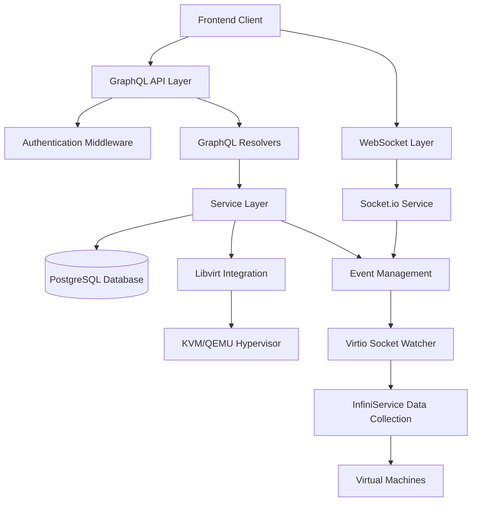

# System Architecture Overview

This document provides a comprehensive overview of the Infinibay backend architecture, covering the system design, component relationships, and key architectural decisions.

## Table of Contents

- [Architecture Overview](#architecture-overview)
- [System Components](#system-components)
- [Communication Patterns](#communication-patterns)
- [Technology Stack](#technology-stack)
- [Design Principles](#design-principles)
- [Scalability Considerations](#scalability-considerations)

## Architecture Overview

Infinibay follows a layered microservices architecture with clear separation of concerns:



## System Components

### 1. API Layer
- **GraphQL Server**: Apollo Server with TypeGraphQL decorators
- **Authentication**: JWT-based authentication with role-based access control
- **Authorization**: Method-level authorization using decorators
- **Error Handling**: Centralized error handling with custom error types

### 2. Service Layer
- **Business Logic**: Encapsulated in service classes
- **VM Lifecycle Management**: Machine creation, state management, destruction
- **Network Management**: Virtual network and firewall configuration
- **Security Services**: Network filtering and security policy enforcement
- **Event Management**: Real-time event coordination and broadcasting

### 3. Data Layer
- **Prisma ORM**: Type-safe database operations
- **PostgreSQL**: Primary data store with ACID compliance
- **Schema Management**: Prisma migrations for version control
- **Relationship Management**: Complex entity relationships with foreign keys

### 4. Real-time Layer
- **Socket.io**: WebSocket communication for real-time updates
- **Event Broadcasting**: User-specific and admin event channels
- **Metrics Streaming**: Live VM performance data
- **State Synchronization**: Real-time UI state updates

### 5. Virtualization Layer
- **Libvirt Integration**: Custom Rust bindings for native libvirt access
- **VM Management**: Domain lifecycle, configuration, and monitoring
- **Network Management**: Virtual networks, bridges, and filters
- **Storage Management**: Volume creation, attachment, and management

### 6. Data Collection Layer
- **InfiniService Integration**: Rust-based service for VM metrics collection
- **Virtio Socket Communication**: Efficient host-guest communication
- **Metrics Processing**: System metrics, process tracking, application usage

## Communication Patterns

### 1. Request-Response Pattern
Used for standard GraphQL operations:
```
Client --> GraphQL API --> Service Layer --> Database --> Response
```

### 2. Event-Driven Pattern
Used for real-time updates:
```
Service Action --> Event Manager --> Socket.io --> Client
```

### 3. Pub/Sub Pattern
Used for broadcasting events:
```
VM State Change --> Event Manager --> Multiple Subscribers --> UI Updates
```

### 4. Pipeline Pattern
Used for complex operations:
```
Create VM Request --> Validation --> Template Processing --> XML Generation --> Libvirt API --> Database Update --> Event Broadcast
```

## Technology Stack

### Core Technologies
- **Runtime**: Node.js with TypeScript
- **API Framework**: Apollo Server (GraphQL)
- **ORM**: Prisma with PostgreSQL
- **Real-time**: Socket.io
- **Virtualization**: Libvirt with custom Rust bindings

### Development Tools
- **Testing**: Jest with comprehensive mocking
- **Linting**: ESLint with TypeScript rules
- **Type Safety**: TypeScript in strict mode
- **Build**: TypeScript compiler
- **Process Management**: Native Node.js clustering

### External Dependencies
- **Database**: PostgreSQL 12+
- **Hypervisor**: KVM/QEMU with libvirt
- **System Service**: InfiniService for metrics collection

## Design Principles

### 1. Type Safety First
- Full TypeScript implementation
- Prisma for database type safety
- TypeGraphQL for API type safety
- Strong typing throughout the codebase

### 2. Separation of Concerns
- Clear layer boundaries
- Single responsibility principle
- Dependency injection patterns
- Modular service architecture

### 3. Event-Driven Architecture
- Loosely coupled components
- Asynchronous communication
- Real-time state synchronization
- Scalable event processing

### 4. Domain-Driven Design
- Business logic encapsulation
- Rich domain models
- Service-oriented architecture
- Clear API contracts

### 5. Testability
- Comprehensive mocking strategy
- Isolated unit testing
- Integration test coverage
- Mock libvirt implementation

## Scalability Considerations

### 1. Horizontal Scaling
- Stateless service design
- Load balancer ready
- Session management via JWT
- Database connection pooling

### 2. Performance Optimization
- Database query optimization
- N+1 query prevention
- Efficient caching strategies
- Connection reuse patterns

### 3. Resource Management
- Graceful shutdown handling
- Connection cleanup
- Memory management
- CPU-intensive operation handling

### 4. Monitoring & Observability
- Structured logging with Winston
- Debug logging categories
- Performance metrics collection
- Health check endpoints

## Key Architectural Decisions

### 1. GraphQL over REST
**Decision**: Use GraphQL as the primary API interface

**What it provides**: A strongly-typed, flexible API that allows clients to request exactly the data they need while providing real-time subscriptions and excellent developer tooling.

**Why GraphQL was chosen**:
- **Type Safety**: Schema-first approach ensures compile-time validation and prevents runtime type errors
- **Efficient Data Fetching**: Clients can request multiple related resources in a single query, reducing network round trips
- **Strong Tooling Ecosystem**: Excellent IDE support, automated documentation, and code generation capabilities
- **Real-time Subscriptions**: Built-in support for real-time updates through WebSocket subscriptions
- **API Evolution**: Schema evolution without versioning - deprecated fields can coexist with new ones

**What this enables**:
- **Developer Productivity**: Frontend developers can work independently with clear API contracts
- **Performance Optimization**: Eliminates over-fetching and under-fetching of data
- **Rapid Development**: Strongly-typed schema enables automated code generation and validation
- **Future-Proof Architecture**: API can evolve without breaking existing clients

### 2. TypeScript Throughout
**Decision**: Full TypeScript implementation across the entire backend codebase

**What it provides**: Compile-time type checking, enhanced IDE support, and self-documenting code that catches errors before they reach production.

**Why TypeScript was essential**:
- **Compile-time Error Detection**: Catches type-related bugs during development rather than runtime
- **Enhanced IDE Support**: IntelliSense, auto-completion, and refactoring tools work reliably
- **Self-documenting Code**: Type definitions serve as living documentation of API contracts
- **Easier Refactoring**: Large-scale code changes can be made confidently with type checking
- **Team Productivity**: Reduces debugging time and improves code review quality

**What this enables**:
- **Enterprise-Grade Reliability**: Eliminates entire categories of runtime errors common in dynamic languages
- **Developer Confidence**: Developers can refactor and modify code knowing the compiler will catch type-related issues
- **API Contract Enforcement**: Database schemas, GraphQL types, and service interfaces are all type-checked
- **Scalable Development**: Large teams can work on the codebase without breaking each other's code

### 3. Custom Libvirt Bindings
**Decision**: Build custom Rust-based libvirt bindings instead of using existing Node.js FFI solutions

**What it provides**: High-performance, memory-safe, and type-safe bindings to the libvirt virtualization API that integrate seamlessly with the Node.js runtime.

**Why custom Rust bindings were necessary**:
- **Performance Superiority**: Rust bindings eliminate the overhead of FFI calls and provide near-native performance
- **Memory Safety**: Rust's ownership model prevents memory leaks and segmentation faults common with C bindings
- **Type Safety**: Strong typing prevents common virtualization API misuse errors
- **Direct API Access**: Full access to libvirt's extensive API without wrapper limitations
- **Cross-Platform Compatibility**: Rust's build system handles platform-specific compilation complexities

**What this enables**:
- **Production Reliability**: Memory safety and error handling eliminate crashes from virtualization operations
- **High Performance**: VM operations execute with minimal overhead, supporting high-density deployments
- **Rich Functionality**: Access to advanced libvirt features like live migration, snapshots, and performance monitoring
- **Maintainable Code**: Type-safe APIs reduce debugging time and increase developer confidence

### 4. Event-Driven Real-time Updates
**Decision**: Use event-driven architecture for real-time features
**Rationale**:
- Loosely coupled components
- Scalable broadcast patterns
- Efficient state synchronization
- User-specific update channels

### 5. Service Layer Abstraction
**Decision**: Abstract business logic into service classes
**Rationale**:
- Testable business logic
- Reusable components
- Clear API boundaries
- Separation of GraphQL concerns

## Security Architecture

### 1. Authentication
- JWT token-based authentication
- Role-based access control (RBAC)
- Token expiration and refresh
- Secure token storage

### 2. Authorization
- Method-level authorization decorators
- Resource-based access control
- Admin vs user privilege separation
- Department-based VM access control

### 3. Network Security
- Libvirt network filters
- Firewall rule management
- Department-based network isolation
- Service-specific access controls

### 4. Data Protection
- Input validation and sanitization
- SQL injection prevention via Prisma
- XSS protection in GraphQL
- Secure environment variable handling

## Performance Characteristics

### 1. Database Performance
- Prisma query optimization
- Connection pooling
- Proper indexing strategy
- Relationship loading optimization

### 2. Real-time Performance
- Efficient WebSocket connections
- Selective event broadcasting
- Connection state management
- Heartbeat and reconnection logic

### 3. Virtualization Performance
- Native libvirt bindings
- Efficient XML generation
- Bulk operation support
- Resource cleanup automation

This architecture supports Infinibay's requirements for scalable, secure, and maintainable virtualization management while providing excellent developer experience and type safety.