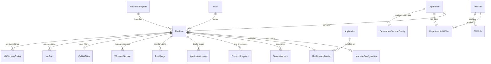

# Database Schema Documentation

This document provides comprehensive documentation of the Infinibay database schema, including all models, relationships, and data patterns.

## Table of Contents

- [Schema Overview](#schema-overview)
- [Core Entities](#core-entities)
- [Relationships](#relationships)
- [Metrics & Analytics](#metrics--analytics)
- [Security Models](#security-models)
- [Data Types & Constraints](#data-types--constraints)
- [Migration Strategy](#migration-strategy)

## Schema Overview

The Infinibay database schema is designed around virtualization management with support for:
- **User Management**: Authentication and role-based access
- **VM Lifecycle**: Machine templates, configurations, and state
- **Network Security**: Firewall rules and network filtering
- **Department Organization**: Multi-tenant resource organization
- **Metrics Collection**: Comprehensive VM monitoring data
- **Application Management**: Software installation and tracking



## Core Entities

### User
The `User` model represents system users with authentication and role management.

```prisma
model User {
  id        String   @id @default(uuid())
  email     String   @unique
  password  String   // Bcrypt hashed
  deleted   Boolean
  token     String   @default("null")
  firstName String
  lastName  String
  avatar    String?
  role      String   // 'ADMIN' or 'USER'
  createdAt DateTime @default(now())
  
  // Relations
  VM Machine[]
}
```

**Key Features:**
- UUID primary keys for security
- Email-based authentication
- Role-based access control
- Soft deletion support
- Optional profile images

### Machine
The `Machine` model is the core entity representing virtual machines.

```prisma
model Machine {
  id                 String   @id @default(uuid())
  name               String   // User-friendly name
  internalName       String   // Libvirt domain name
  status             String   // 'running', 'off', 'suspended', etc.
  userId             String?  // Optional user assignment
  templateId         String   // Required template reference
  os                 String   // Operating system type
  
  // Hardware Configuration
  cpuCores           Int      @default(0)
  ramGB              Int      @default(0)
  diskSizeGB         Int      @default(0)
  gpuPciAddress      String?  // Optional GPU assignment
  
  // System Fields
  createdAt          DateTime @default(now())
  updatedAt          DateTime @updatedAt
  
  // Relations
  template           MachineTemplate @relation(fields: [templateId], references: [id])
  user               User?           @relation(fields: [userId], references: [id])
  applications       MachineApplication[]
  configuration      MachineConfiguration?
  departmentId       String?
  department         Department?     @relation(fields: [departmentId], references: [id])
  
  // Additional Relations
  pendingCommands    PendingCommand[]
  ports              VmPort[]
  nwFilters          VMNWFilter[]
  serviceConfigs     VMServiceConfig[]
  
  // Metrics Relations
  systemMetrics      SystemMetrics[]
  processSnapshots   ProcessSnapshot[]
  applicationUsage   ApplicationUsage[]
  portUsage          PortUsage[]
  windowsServices    WindowsService[]
}
```

**Key Features:**
- Flexible user assignment (can be unassigned)
- Template-based provisioning
- Hardware resource tracking
- Department-based organization
- Comprehensive metrics collection

### MachineTemplate
Templates define the blueprint for creating virtual machines.

```prisma
model MachineTemplate {
  id            String @id @default(uuid())
  name          String
  description   String?
  cores         Int     // CPU cores
  ram           Int     // RAM in GB
  storage       Int     // Storage in GB
  createdAt     DateTime @default(now())
  
  // Relations
  machines      Machine[]
  categoryId    String?
  category      MachineTemplateCategory? @relation(fields: [categoryId], references: [id])
}
```

### Department
Departments provide multi-tenant organization and security boundaries.

```prisma
model Department {
  id            String   @id @default(uuid())
  name          String
  createdAt     DateTime @default(now())
  internetSpeed Int?     // in Mbps
  ipSubnet      String?  // Network subnet assignment
  
  // Relations
  machines      Machine[]
  nwFilters     DepartmentNWFilter[]
  configuration DepartmentConfiguration?
  serviceConfigs DepartmentServiceConfig[]
}
```

## Relationships

### One-to-Many Relationships

1. **User → Machine**: Users can own multiple VMs
2. **Department → Machine**: Departments contain multiple VMs
3. **MachineTemplate → Machine**: Templates can spawn multiple VMs
4. **NWFilter → FWRule**: Filters contain multiple firewall rules

### One-to-One Relationships

1. **Machine → MachineConfiguration**: Each VM has one configuration
2. **Department → DepartmentConfiguration**: Each department has one config

### Many-to-Many Relationships

1. **Machine ↔ Application**: VMs can have multiple applications, applications can be on multiple VMs
2. **Department ↔ NWFilter**: Departments can use multiple filters, filters can apply to multiple departments
3. **Machine ↔ NWFilter**: VMs can use multiple filters

## Metrics & Analytics

The schema includes comprehensive metrics collection for VM monitoring:

### SystemMetrics
Real-time system performance data:

```prisma
model SystemMetrics {
  id          String   @id @default(uuid())
  machineId   String
  machine     Machine  @relation(fields: [machineId], references: [id], onDelete: Cascade)

  // CPU Metrics
  cpuUsagePercent     Float
  cpuCoresUsage       Json    // Array of per-core usage
  cpuTemperature      Float?

  // Memory Metrics
  totalMemoryKB       BigInt
  usedMemoryKB        BigInt
  availableMemoryKB   BigInt
  swapTotalKB         BigInt?
  swapUsedKB          BigInt?

  // Disk & Network
  diskUsageStats      Json    // Disk usage per mount point
  diskIOStats         Json    // I/O statistics
  networkStats        Json    // Network interface statistics

  // System Info
  uptime              BigInt  // System uptime in seconds
  loadAverage         Json?   // Load averages (Linux)

  timestamp           DateTime @default(now())

  @@index([machineId, timestamp])
}
```

### ApplicationUsage
Tracks application installation and usage:

```prisma
model ApplicationUsage {
  id              String   @id @default(uuid())
  machineId       String
  machine         Machine  @relation(fields: [machineId], references: [id], onDelete: Cascade)

  executablePath  String   // Full path to executable
  applicationName String   // Friendly name
  version         String?
  description     String?
  publisher       String?

  // Usage Statistics
  lastAccessTime     DateTime?
  lastModifiedTime   DateTime?
  accessCount        Int      @default(0)
  totalUsageMinutes  Int      @default(0)

  // Metadata
  iconData           Bytes?   // Application icon (PNG, 64x64)
  iconFormat         String?
  fileSize           BigInt?

  // Tracking
  firstSeen          DateTime @default(now())
  lastSeen           DateTime @default(now())
  isActive           Boolean  @default(true)

  @@unique([machineId, executablePath])
  @@index([machineId, lastAccessTime])
  @@index([machineId, isActive])
}
```

## Security Models

### Network Filtering System

The schema implements a sophisticated network filtering system:

```prisma
model NWFilter {
  id            String   @id @default(uuid())
  name          String   @unique
  internalName  String   @unique  // Libvirt filter name
  uuid          String   @unique  // Libvirt UUID
  description   String?
  chain         String?  // ipv4, arp, etc.
  type          String   @default("generic") // generic, department, vm
  priority      Int      @default(500)
  stateMatch    Boolean  @default(true)
  
  // Timestamps
  createdAt     DateTime @default(now())
  updatedAt     DateTime @updatedAt
  flushedAt     DateTime? // Last applied to libvirt
  
  // Relations
  rules         FWRule[]
  departments   DepartmentNWFilter[]
  vms          VMNWFilter[]
  
  // Self-referential relationships for filter inheritance
  referencedBy    FilterReference[] @relation("ReferencingFilters")
  references      FilterReference[] @relation("ReferencedFilters")
}
```

### Firewall Rules

```prisma
model FWRule {
  id          String    @id @default(uuid())
  nwFilter    NWFilter  @relation(fields: [nwFilterId], references: [id], onDelete: Cascade)
  nwFilterId  String
  
  // Rule Configuration
  action      String    @default("accept") // accept, reject, drop
  direction   String    @default("inout")  // in, out, inout
  priority    Int
  protocol    String    @default("all")    // tcp, udp, icmp, all
  ipVersion   String?   // ipv4, ipv6
  
  // Source/Destination
  srcMacAddr  String?
  srcIpAddr   String?
  srcIpMask   String?
  dstIpAddr   String?
  dstIpMask   String?
  srcPortStart Int?     // 0-65535
  srcPortEnd   Int?
  dstPortStart Int?
  dstPortEnd   Int?
  
  // Connection State
  state       Json?     // NEW, ESTABLISHED, RELATED
  comment     String?
  
  createdAt   DateTime  @default(now())
  updatedAt   DateTime  @updatedAt
}
```

## Data Types & Constraints

### Primary Keys
- All entities use UUID primary keys for security and distribution
- Generated using Prisma's `@default(uuid())`

### Unique Constraints
- Email addresses must be unique across users
- Internal names must be unique across machines
- Network filter names and UUIDs must be unique

### Indexes
- Performance-critical queries have dedicated indexes
- Timestamp-based queries for metrics are optimized
- Foreign key relationships are automatically indexed

### Cascading Deletes
- Machine deletion cascades to configurations and metrics
- Department deletion cascades to configurations
- Filter deletion cascades to rules

## Migration Strategy

### Database Migrations
Prisma handles schema migrations with version control:

```bash
# Create new migration
npx prisma migrate dev --name migration_description

# Apply migrations in production
npx prisma migrate deploy

# Reset database (development only)
npx prisma migrate reset
```

### Data Seeding
Initial data population through seed scripts:

```bash
# Run seeding
npm run db:seed
```

Seed data includes:
- Default applications
- Global service configurations
- Initial network filters
- System templates

### Schema Evolution
- Additive changes preferred over breaking changes
- Nullable fields for backward compatibility
- Data migration scripts for complex changes
- Version control for all schema modifications

## Best Practices

### 1. Data Integrity
- Use foreign key constraints for referential integrity
- Implement proper cascade rules
- Validate data at both database and application levels

### 2. Performance
- Add indexes for frequently queried fields
- Use efficient data types (BigInt for large numbers)
- Implement pagination for large result sets

### 3. Security
- Never store plaintext passwords (use bcrypt)
- Use UUIDs for public-facing identifiers
- Implement soft deletes where appropriate

### 4. Monitoring
- Track metrics collection performance
- Monitor database query performance
- Implement alerting for schema issues

This schema design supports Infinibay's requirements for scalable virtualization management while maintaining data integrity, security, and performance.