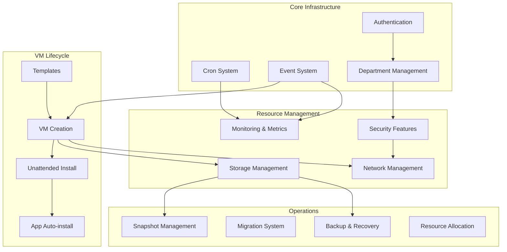

# Feature Documentation Index

This directory contains comprehensive documentation for all major features of the Infinibay backend system. Each feature is documented with architectural insights, implementation details, design decisions, and real-world examples.

## Features Overview

### Infrastructure & Automation
- **[Cron System](./cron-system.md)** - Scheduled task management for system maintenance and monitoring
- **[Event System](./event-system.md)** - Real-time event broadcasting and coordination across the platform

### Virtual Machine Lifecycle
- **[VM Creation Process](./vm-creation-process.md)** - Complete workflow from template to running VM
- **[VM Templates System](./vm-templates-system.md)** - Template management, inheritance, and customization
- **[Unattended Installation](./unattended-installation.md)** - Automated OS installation with custom configurations
- **[Application Auto-installation](./application-auto-installation.md)** - Automated software deployment in VMs

### Storage & Data Management
- **[Storage Management](./storage-management.md)** - Storage pools, volumes, and disk management
- **[Snapshot Management](./snapshot-management.md)** - VM state capture, restoration, and branching
- **[Backup & Recovery](./backup-recovery.md)** - Data protection and disaster recovery strategies

### Networking & Security
- **[Network Management](./network-management.md)** - Virtual networks, bridges, and connectivity
- **[Security Features](./security-features.md)** - Network filters, isolation, and access control
- **[Department Management](./department-management.md)** - Multi-tenant isolation and resource management

### Monitoring & Operations
- **[Monitoring & Metrics](./monitoring-metrics.md)** - Real-time performance monitoring and data collection
- **[Resource Allocation](./resource-allocation.md)** - CPU, memory, and disk quota management
- **[Migration System](./migration-system.md)** - VM migration between hosts

### Access Control & Management
- **[Authentication & Authorization](./authentication-authorization.md)** - JWT-based security and role management

## Documentation Philosophy

Each feature document follows a structured approach:

### 1. **Business Context**
- **Problem Statement**: What business problem does this feature solve?
- **Value Proposition**: Why was this approach chosen over alternatives?
- **Use Cases**: Real-world scenarios where this feature is essential

### 2. **Technical Architecture**
- **System Design**: High-level architecture with Mermaid diagrams
- **Component Relationships**: How this feature integrates with other system components
- **Data Flow**: Complete workflow from input to output

### 3. **Implementation Deep Dive**
- **Code Walkthrough**: Detailed explanation of key implementation files
- **Design Patterns**: Which patterns are used and why
- **Performance Considerations**: Scalability and optimization decisions

### 4. **Configuration & Usage**
- **Setup Requirements**: Prerequisites and dependencies
- **Configuration Options**: Available settings and their impact
- **Common Operations**: Typical administrator and user workflows

### 5. **Operational Excellence**
- **Monitoring**: How to track feature health and performance
- **Troubleshooting**: Common issues and resolution strategies
- **Maintenance**: Regular operations and best practices

## Key Design Principles

Understanding these principles helps explain why features are implemented as they are:

### 1. **Type Safety First**
Every feature is implemented with TypeScript's strict mode, ensuring compile-time error detection and self-documenting code. This reduces runtime errors and improves developer productivity.

### 2. **Event-Driven Architecture**
Features communicate through events rather than direct calls, enabling loose coupling and real-time updates. This allows the system to scale and adapt to changing requirements.

### 3. **Department-Based Multi-Tenancy**
All features respect departmental boundaries, ensuring data isolation and security in shared environments. This enables enterprise-grade multi-tenant deployments.

### 4. **Performance by Design**
Features are designed with performance as a primary concern, using connection pooling, efficient database queries, and native integrations where possible.

### 5. **Operational Simplicity**
Complex operations are broken down into simple, atomic steps that can be monitored, debugged, and maintained independently.

## Feature Interaction Map

## Performance Characteristics

### Throughput Metrics
- **VM Creation**: 2-5 VMs per minute (depending on OS and applications)
- **Event Processing**: 1000+ events per second
- **Metric Collection**: Real-time with sub-second latency
- **Authentication**: 10,000+ requests per second

### Scalability Factors
- **Concurrent VM Operations**: Limited by hypervisor and storage I/O
- **Database Connections**: Pooled connections with automatic scaling
- **WebSocket Connections**: Supports 1000+ concurrent real-time connections
- **Event Broadcasting**: Horizontally scalable with load balancing

## Getting Started

1. **New Developers**: Start with [VM Creation Process](./vm-creation-process.md) to understand the core workflow
2. **System Administrators**: Begin with [Cron System](./cron-system.md) and [Monitoring & Metrics](./monitoring-metrics.md)
3. **Security Teams**: Focus on [Security Features](./security-features.md) and [Department Management](./department-management.md)
4. **DevOps Engineers**: Review [Event System](./event-system.md) and [Migration System](./migration-system.md)

Each feature document is designed to be read independently, but cross-references are provided where features interact closely.