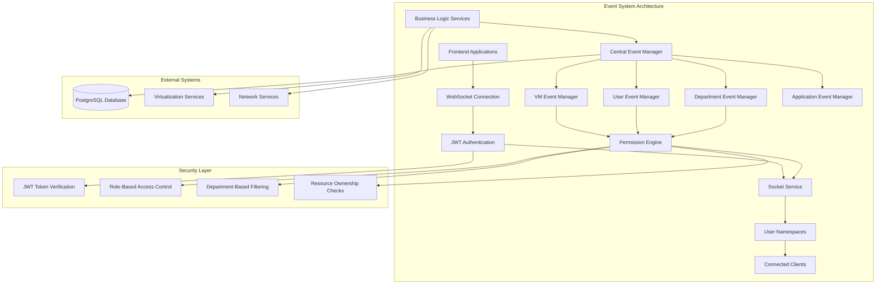
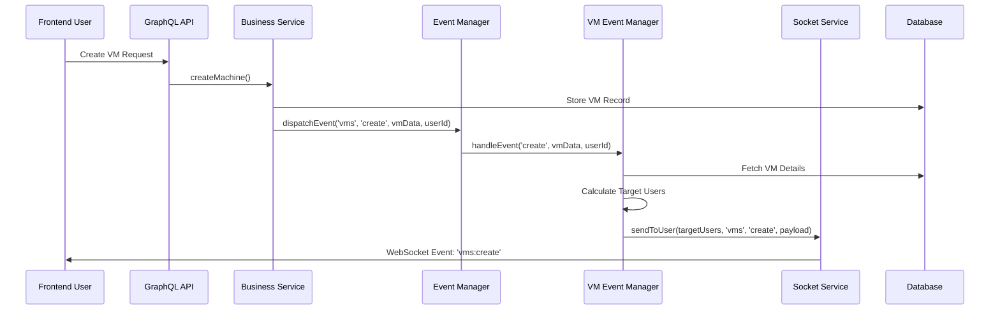
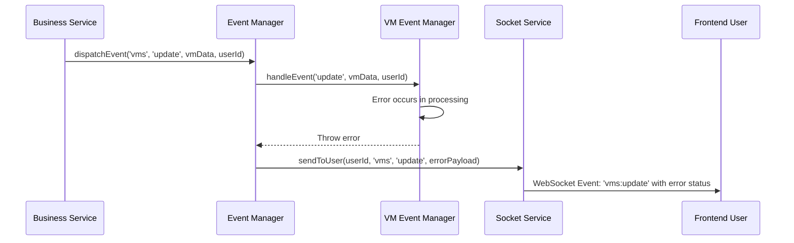

# Event System: Real-time Communication & Coordination

## Overview

The Infinibay Event System is a sophisticated real-time communication infrastructure that enables instant coordination between the backend services and frontend interfaces. This system provides real-time updates, user-specific event routing, and department-aware broadcasting while maintaining security boundaries and ensuring reliable message delivery.

## Business Context

### Problem Statement

Traditional web applications face several challenges with real-time communication:

1. **State Synchronization**: Multiple users viewing the same data need consistent, up-to-date information
2. **User Experience**: Users expect immediate feedback when they or others perform actions
3. **Operational Awareness**: Administrators need real-time visibility into system status and user activities
4. **Resource Coordination**: Multiple users managing shared resources (VMs, networks) need coordination
5. **Security Boundaries**: Real-time updates must respect user permissions and department isolation

### Why This Approach?

Infinibay's Event System solves these challenges through:

**Centralized Event Coordination**: Single event manager coordinates all real-time communication with pluggable resource-specific handlers.

**Security-Aware Broadcasting**: Events are automatically filtered based on user roles, department membership, and resource ownership.

**Type-Safe Event Handling**: Strong typing ensures events are processed correctly and reduces runtime errors.

**Scalable Architecture**: Event system supports horizontal scaling and can handle thousands of concurrent connections.

**Reliable Delivery**: Error handling and fallback mechanisms ensure critical events are delivered.

### Business Value

- **Enhanced User Experience**: Real-time updates eliminate the need for manual page refreshes
- **Improved Collaboration**: Multiple users can work on shared resources with live coordination
- **Operational Efficiency**: Administrators receive immediate alerts about system changes
- **Reduced Support Load**: Users see status changes immediately, reducing "why is this not working" support tickets
- **Compliance**: Complete audit trail of all system activities with real-time logging
- **Scalability**: Architecture supports enterprise-scale deployments with thousands of users

## Technical Architecture

### System Design



### Component Relationships

The event system operates through a layered architecture where security and permissions are enforced at multiple levels:

1. **WebSocket Authentication**: JWT-based authentication verifies user identity and establishes secure connections
2. **Central Event Manager**: Coordinates all events and delegates to resource-specific managers
3. **Resource Event Managers**: Handle events specific to VMs, users, departments, and applications
4. **Permission Engine**: Determines which users should receive specific events based on roles and ownership
5. **Socket Service**: Manages WebSocket connections and delivers events to appropriate clients
6. **User Namespaces**: Provides isolated communication channels for each authenticated user

## Implementation Deep Dive

### Central Event Manager

**File**: `/home/andres/infinibay/backend/app/services/EventManager.ts`

The EventManager serves as the central coordination point for all real-time events in the system.

#### Core Event Coordination

```typescript
export class EventManager {
  private resourceManagers: Map<string, ResourceEventManager> = new Map()
  private socketService: SocketService
  private prisma: PrismaClient

  constructor(socketService: SocketService, prisma: PrismaClient) {
    this.socketService = socketService
    this.prisma = prisma
  }

  // Register a resource-specific event manager
  registerResourceManager(resource: string, manager: ResourceEventManager): void {
    this.resourceManagers.set(resource, manager)
    console.log(`📋 Registered event manager for resource: ${resource}`)
  }

  // Main event dispatch method
  async dispatchEvent(
    resource: string,
    action: EventAction,
    data: any,
    triggeredBy?: string
  ): Promise<void> {
    try {
      console.log(`🎯 Dispatching event: ${resource}:${action}`, {
        dataId: data?.id,
        triggeredBy
      })

      // Get the appropriate resource manager
      const manager = this.resourceManagers.get(resource)
      if (!manager) {
        console.warn(`⚠️ No event manager found for resource: ${resource}`)
        return
      }

      // Let the resource manager handle the event
      await manager.handleEvent(action, data, triggeredBy)

      console.log(`✅ Event dispatched successfully: ${resource}:${action}`)
    } catch (error) {
      console.error(`❌ Error dispatching event ${resource}:${action}:`, error)

      // Send error event to triggering user if available
      if (triggeredBy) {
        this.socketService.sendToUser(triggeredBy, resource, action, {
          status: 'error',
          error: error instanceof Error ? error.message : 'Unknown error occurred'
        })
      }
    }
  }
}
```

**What it does**: Provides centralized event coordination with pluggable resource-specific handlers.

**Why this architecture**:
- **Single Responsibility**: Each resource manager handles only events for its domain
- **Extensibility**: New resource types can be added without modifying existing code
- **Error Isolation**: Failures in one resource manager don't affect others
- **Logging Consistency**: All events go through the same logging and error handling pipeline

**What for**:
- **Maintainability**: Clear separation of concerns makes the system easy to understand and modify
- **Reliability**: Centralized error handling ensures consistent behavior across all event types
- **Observability**: Centralized logging provides comprehensive audit trail
- **Performance**: Event routing is optimized and events only go to relevant handlers

#### Event Action Types

```typescript
export type EventAction = 'create' | 'update' | 'delete' | 'power_on' | 'power_off' | 'suspend' | 'resume'

export interface EventPayload {
  status: 'success' | 'error'
  error?: string
  data?: any
}
```

**What it defines**: Standard event action types and payload structure for all events in the system.

**Why standardized types**:
- **Type Safety**: TypeScript ensures only valid event actions are used
- **API Consistency**: Frontend and backend use the same event action vocabulary
- **Documentation**: Event types serve as living documentation of system capabilities
- **Testing**: Standard types enable comprehensive testing of event flows

### VM Event Manager

**File**: `/home/andres/infinibay/backend/app/services/VmEventManager.ts`

The VmEventManager handles all VM-related events with sophisticated permission checking and user targeting.

#### Permission-Aware Event Handling

```typescript
export class VmEventManager implements ResourceEventManager {
  async handleEvent(action: EventAction, vmData: any, triggeredBy?: string): Promise<void> {
    try {
      console.log(`🖥️ Handling VM event: ${action}`, { vmId: vmData?.id, triggeredBy })

      // Get fresh VM data from database if we only have an ID
      const vm = await this.getVmData(vmData)
      if (!vm) {
        console.warn(`⚠️ VM not found for event: ${vmData?.id}`)
        return
      }

      // Determine which users should receive this event
      const targetUsers = await this.getTargetUsers(vm, action)

      // Create event payload
      const payload: EventPayload = {
        status: 'success',
        data: vm
      }

      // Send event to each target user
      for (const userId of targetUsers) {
        this.socketService.sendToUser(userId, 'vms', action, payload)
      }

      console.log(`✅ VM event sent to ${targetUsers.length} users: ${action}`)
    } catch (error) {
      console.error(`❌ Error handling VM event ${action}:`, error)
      throw error
    }
  }
}
```

**What it does**: Handles VM events by determining appropriate recipients and delivering events through WebSocket connections.

**Why this approach**:
- **Security First**: Every event checks permissions before delivery
- **Fresh Data**: Always fetches current VM state to ensure accuracy
- **Efficient Targeting**: Only sends events to users who should receive them
- **Error Recovery**: Comprehensive error handling with detailed logging

#### Sophisticated Permission Engine

```typescript
private async getTargetUsers(vm: any, action: EventAction): Promise<string[]> {
  try {
    const targetUsers: Set<string> = new Set()

    // 1. Always include the VM owner (if exists)
    if (vm.userId) {
      targetUsers.add(vm.userId)
    }

    // 2. Include all admin users (they can see everything)
    const adminUsers = await this.prisma.user.findMany({
      where: { 
        role: 'ADMIN',
        deleted: false 
      },
      select: { id: true }
    })
    adminUsers.forEach(admin => targetUsers.add(admin.id))

    // 3. Include users in the same department (if VM has department)
    if (vm.departmentId) {
      const departmentUsers = await this.prisma.user.findMany({
        where: {
          deleted: false,
          VM: {
            some: {
              departmentId: vm.departmentId
            }
          }
        },
        select: { id: true }
      })
      departmentUsers.forEach(user => targetUsers.add(user.id))
    }

    // 4. For certain actions, include all users who can see VMs
    if (action === 'create') {
      const allActiveUsers = await this.prisma.user.findMany({
        where: { deleted: false },
        select: { id: true }
      })
      allActiveUsers.forEach(user => targetUsers.add(user.id))
    }

    return Array.from(targetUsers)
  } catch (error) {
    console.error('Error determining target users:', error)
    return []
  }
}
```

**What it does**: Implements sophisticated permission logic to determine which users should receive VM events.

**Why this complexity**:
- **Security Compliance**: Events respect department boundaries and role-based access control
- **User Experience**: Users see relevant events without being overwhelmed by irrelevant information
- **Privacy Protection**: Users only see VMs they have permission to access
- **Administrative Oversight**: Admins see all events for monitoring and troubleshooting

**Permission Hierarchy**:
1. **VM Owner**: Always receives events for their VMs
2. **Administrators**: Receive all VM events for system oversight
3. **Department Members**: Receive events for VMs in their department
4. **All Users**: Receive certain events (like VM creation) that might affect resource availability

### Socket Service

**File**: `/home/andres/infinibay/backend/app/services/SocketService.ts`

The SocketService manages WebSocket connections, authentication, and message delivery.

#### JWT-Based WebSocket Authentication

```typescript
export class SocketService {
  private io: SocketIOServer | null = null
  private prisma: PrismaClient
  private connectedUsers: Map<string, AuthenticatedSocket> = new Map()

  // Setup JWT authentication middleware
  private setupAuthentication(): void {
    this.io?.use(async (socket: any, next) => {
      try {
        const token = socket.handshake.auth.token || socket.handshake.headers.authorization

        if (!token) {
          return next(new Error('Authentication token required'))
        }

        // Verify JWT token
        const decoded = jwt.verify(token, process.env.TOKENKEY || 'secret') as any

        if (!decoded.userId) {
          return next(new Error('Invalid token payload'))
        }

        // Fetch user from database
        const user = await this.prisma.user.findUnique({
          where: { id: decoded.userId },
          select: {
            id: true,
            email: true,
            firstName: true,
            lastName: true,
            role: true,
            namespace: true
          }
        })

        if (!user) {
          return next(new Error('User not found'))
        }

        // Generate or use existing user namespace
        let userNamespace = user.namespace
        if (!userNamespace) {
          userNamespace = this.generateUserNamespace(user.id)
          await this.prisma.user.update({
            where: { id: user.id },
            data: { namespace: userNamespace }
          })
        }

        // Attach user info to socket
        socket.userId = user.id
        socket.userRole = user.role
        socket.userNamespace = userNamespace
        socket.user = user

        next()
      } catch (error) {
        console.error('Socket authentication error:', error)
        next(new Error('Authentication failed'))
      }
    })
  }
}
```

**What it does**: Authenticates WebSocket connections using JWT tokens and establishes user context for secure communication.

**Why JWT for WebSocket auth**:
- **Stateless Authentication**: No need to maintain session state on the server
- **Security**: Same authentication mechanism as REST API ensures consistency
- **User Context**: Provides complete user information for permission checking
- **Namespace Isolation**: Each user gets a unique namespace for private communication

#### User Namespace Management

```typescript
export interface AuthenticatedSocket {
  id: string
  userId: string
  userRole: string
  userNamespace: string
  user: {
    id: string
    email: string
    firstName: string
    lastName: string
    role: string
  }
}

private generateUserNamespace(userId: string): string {
  return `user_${userId}_${Date.now()}_${Math.random().toString(36).substr(2, 9)}`
}
```

**What it does**: Creates unique namespaces for each user to enable private communication channels.

**Why user namespaces**:
- **Privacy**: Each user has a private channel for personal notifications
- **Security**: Prevents users from receiving events intended for others
- **Scalability**: Enables efficient message routing without checking permissions for every message
- **Multi-Session Support**: Users can have multiple connections with the same namespace

#### Message Delivery System

```typescript
// Send event to specific user
sendToUser(userId: string, resource: string, action: string, payload: any): void {
  try {
    const authenticatedSocket = this.connectedUsers.get(userId)
    if (!authenticatedSocket) {
      console.log(`User ${userId} not connected, skipping event`)
      return
    }

    const eventName = `${resource}:${action}`
    const targetNamespace = authenticatedSocket.userNamespace

    this.io?.to(targetNamespace).emit(eventName, payload)
    
    console.log(`📡 Event sent to user ${userId}: ${eventName}`)
  } catch (error) {
    console.error(`Error sending event to user ${userId}:`, error)
  }
}

// Send event to all admin users
sendToAdmins(resource: string, action: string, payload: any): void {
  try {
    const adminUsers = Array.from(this.connectedUsers.values())
      .filter(socket => socket.userRole === 'ADMIN')

    adminUsers.forEach(adminSocket => {
      const eventName = `${resource}:${action}`
      this.io?.to(adminSocket.userNamespace).emit(eventName, payload)
    })

    console.log(`📡 Admin event sent to ${adminUsers.length} admins: ${resource}:${action}`)
  } catch (error) {
    console.error('Error sending admin event:', error)
  }
}
```

**What it does**: Provides targeted message delivery to specific users or user groups.

**Why targeted delivery**:
- **Efficiency**: Messages only go to users who need them
- **Security**: Prevents unauthorized access to sensitive information
- **Performance**: Reduces network traffic and client-side processing
- **User Experience**: Users only see relevant notifications

## Event Flow Patterns

### Standard Event Flow



### Error Handling Flow



## Configuration & Usage

### Environment Variables

```bash
# WebSocket configuration
FRONTEND_URL="http://localhost:3000"  # CORS origin for WebSocket connections
TOKENKEY="your-jwt-secret-key"        # JWT token verification key

# Socket.io configuration
SOCKET_TRANSPORTS="websocket,polling" # Allowed transport methods
SOCKET_PING_TIMEOUT=60000            # Ping timeout in milliseconds
SOCKET_PING_INTERVAL=25000           # Ping interval in milliseconds
```

### Event Manager Setup

```typescript
// Initialize event system in application startup
import { EventManager } from '@services/EventManager'
import { VmEventManager } from '@services/VmEventManager'
import { UserEventManager } from '@services/UserEventManager'
import { DepartmentEventManager } from '@services/DepartmentEventManager'
import { SocketService } from '@services/SocketService'

export async function initializeEventSystem(
  httpServer: HTTPServer,
  prisma: PrismaClient
): Promise<EventManager> {
  // Initialize Socket Service
  const socketService = new SocketService(prisma)
  socketService.initialize(httpServer)

  // Initialize Event Manager
  const eventManager = new EventManager(socketService, prisma)

  // Register resource-specific event managers
  eventManager.registerResourceManager('vms', new VmEventManager(socketService, prisma))
  eventManager.registerResourceManager('users', new UserEventManager(socketService, prisma))
  eventManager.registerResourceManager('departments', new DepartmentEventManager(socketService, prisma))

  return eventManager
}
```

### Using Events in Business Logic

```typescript
// In a GraphQL resolver or service
export class MachineResolver {
  @Mutation(() => Machine)
  async createMachine(
    @Arg('input') input: CreateMachineInputType,
    @Ctx() { prisma, user, eventManager }: InfinibayContext
  ): Promise<Machine> {
    // Perform machine creation
    const machine = await this.machineService.createMachine(input)

    // Broadcast event to relevant users
    await eventManager.dispatchEvent('vms', 'create', machine, user?.id)

    return machine
  }

  @Mutation(() => Machine)
  async updateMachineStatus(
    @Arg('id') id: string,
    @Arg('status') status: string,
    @Ctx() { prisma, user, eventManager }: InfinibayContext
  ): Promise<Machine> {
    const machine = await this.machineService.updateStatus(id, status)

    // Broadcast status change
    await eventManager.dispatchEvent('vms', 'update', machine, user?.id)

    return machine
  }
}
```

### Frontend Event Consumption

```typescript
// Frontend WebSocket client setup
import io from 'socket.io-client'

class EventService {
  private socket: Socket

  connect(token: string) {
    this.socket = io(process.env.NEXT_PUBLIC_BACKEND_HOST, {
      auth: { token },
      transports: ['websocket', 'polling']
    })

    // Listen for VM events
    this.socket.on('vms:create', (payload) => {
      console.log('New VM created:', payload.data)
      // Update UI state
      dispatch(addVMToList(payload.data))
    })

    this.socket.on('vms:update', (payload) => {
      if (payload.status === 'success') {
        console.log('VM updated:', payload.data)
        dispatch(updateVMInList(payload.data))
      } else {
        console.error('VM update failed:', payload.error)
        dispatch(showErrorNotification(payload.error))
      }
    })

    this.socket.on('vms:delete', (payload) => {
      console.log('VM deleted:', payload.data)
      dispatch(removeVMFromList(payload.data.id))
    })
  }
}
```

## Performance Considerations

### Connection Management

**Efficient Connection Tracking**:

```typescript
// Optimized connection management
export class SocketService {
  private connectedUsers: Map<string, AuthenticatedSocket> = new Map()
  private userConnections: Map<string, Set<string>> = new Map() // userId -> socketIds

  private setupConnectionHandlers(): void {
    this.io?.on('connection', (socket: any) => {
      // Track connection
      this.connectedUsers.set(socket.id, {
        id: socket.id,
        userId: socket.userId,
        userRole: socket.userRole,
        userNamespace: socket.userNamespace,
        user: socket.user
      })

      // Track multiple connections per user
      if (!this.userConnections.has(socket.userId)) {
        this.userConnections.set(socket.userId, new Set())
      }
      this.userConnections.get(socket.userId)?.add(socket.id)

      // Handle disconnection cleanup
      socket.on('disconnect', () => {
        this.connectedUsers.delete(socket.id)
        this.userConnections.get(socket.userId)?.delete(socket.id)
        
        // Clean up empty user connection sets
        if (this.userConnections.get(socket.userId)?.size === 0) {
          this.userConnections.delete(socket.userId)
        }
      })
    })
  }
}
```

### Event Batching

**Efficient Event Processing**:

```typescript
// Batch events for better performance
export class EventBatcher {
  private eventQueue: Map<string, Array<any>> = new Map()
  private batchTimer: NodeJS.Timeout | null = null
  private batchInterval = 100 // 100ms

  addEvent(userId: string, event: any): void {
    if (!this.eventQueue.has(userId)) {
      this.eventQueue.set(userId, [])
    }
    this.eventQueue.get(userId)?.push(event)

    // Start batch timer if not already running
    if (!this.batchTimer) {
      this.batchTimer = setTimeout(() => this.processBatch(), this.batchInterval)
    }
  }

  private processBatch(): void {
    for (const [userId, events] of this.eventQueue.entries()) {
      this.socketService.sendBatchToUser(userId, events)
    }
    
    this.eventQueue.clear()
    this.batchTimer = null
  }
}
```

### Memory Management

**Connection Cleanup**:

```typescript
// Prevent memory leaks with proper cleanup
export class SocketService {
  private connectionCleanupInterval: NodeJS.Timeout

  initialize(httpServer: HTTPServer): void {
    // ... setup code ...

    // Periodic cleanup of stale connections
    this.connectionCleanupInterval = setInterval(() => {
      this.cleanupStaleConnections()
    }, 60000) // Every minute
  }

  private cleanupStaleConnections(): void {
    const staleThreshold = Date.now() - (5 * 60 * 1000) // 5 minutes

    for (const [socketId, socket] of this.connectedUsers.entries()) {
      // Check if socket is still connected
      const socketInstance = this.io?.sockets.sockets.get(socketId)
      if (!socketInstance || !socketInstance.connected) {
        this.connectedUsers.delete(socketId)
        this.userConnections.get(socket.userId)?.delete(socketId)
      }
    }
  }

  shutdown(): void {
    if (this.connectionCleanupInterval) {
      clearInterval(this.connectionCleanupInterval)
    }
    this.io?.close()
  }
}
```

## Security Considerations

### Authentication Security

**JWT Token Validation**:

```typescript
// Secure token verification
private async verifyToken(token: string): Promise<any> {
  try {
    // Verify token signature and expiration
    const decoded = jwt.verify(token, process.env.TOKENKEY || 'secret', {
      algorithms: ['HS256'],
      maxAge: '24h'
    }) as any

    // Additional validation
    if (!decoded.userId || !decoded.exp) {
      throw new Error('Invalid token structure')
    }

    // Check if token is not expired (additional check)
    if (Date.now() >= decoded.exp * 1000) {
      throw new Error('Token expired')
    }

    return decoded
  } catch (error) {
    throw new Error(`Token verification failed: ${error.message}`)
  }
}
```

### Event Content Security

**Data Sanitization**:

```typescript
// Sanitize event data before sending
private sanitizeEventData(data: any, userRole: string): any {
  const sanitized = { ...data }

  // Remove sensitive fields based on user role
  if (userRole !== 'ADMIN') {
    delete sanitized.internalConfiguration
    delete sanitized.sensitiveMetrics
    delete sanitized.systemPaths
  }

  // Remove null/undefined values
  Object.keys(sanitized).forEach(key => {
    if (sanitized[key] === null || sanitized[key] === undefined) {
      delete sanitized[key]
    }
  })

  return sanitized
}
```

### Department Isolation

**Permission Boundary Enforcement**:

```typescript
// Ensure department boundaries are respected
private async validateDepartmentAccess(
  userId: string, 
  resourceDepartmentId: string
): Promise<boolean> {
  const user = await this.prisma.user.findUnique({
    where: { id: userId },
    select: { role: true, departmentId: true }
  })

  // Admins can access all departments
  if (user?.role === 'ADMIN') {
    return true
  }

  // Users can only access their own department
  return user?.departmentId === resourceDepartmentId
}
```

## Troubleshooting Guide

### Common Issues

#### WebSocket Connection Failures

**Symptom**: Frontend cannot establish WebSocket connection

**Diagnosis**:
```bash
# Check if WebSocket endpoint is accessible
curl -I http://backend-host:4000/socket.io/

# Check CORS configuration
grep FRONTEND_URL /opt/infinibay/backend/.env

# Check JWT token
# In browser console:
console.log(localStorage.getItem('token'))
```

**Solutions**:
1. **CORS Issues**: Verify `FRONTEND_URL` environment variable matches frontend origin
2. **Token Issues**: Ensure JWT token is valid and not expired
3. **Network Issues**: Check firewall rules and load balancer configuration

#### Events Not Being Received

**Symptom**: Frontend doesn't receive real-time updates

**Diagnosis**:
```typescript
// Add debugging to event flow
console.log('Event dispatched:', resource, action, data)
console.log('Target users:', targetUsers)
console.log('Connected users:', Array.from(this.connectedUsers.keys()))
```

**Solutions**:
1. **Permission Issues**: Verify user has permission to receive the event
2. **Connection Issues**: Check if user's WebSocket connection is active
3. **Event Manager Registration**: Ensure resource event manager is registered

#### Performance Issues

**Symptom**: High CPU usage or memory consumption

**Diagnosis**:
```bash
# Monitor connection count
netstat -an | grep :4000 | wc -l

# Check memory usage
ps aux | grep node

# Monitor event frequency
tail -f /var/log/infinibay/events.log | grep "Event dispatched"
```

**Solutions**:
1. **Connection Limits**: Implement connection limits per user
2. **Event Batching**: Batch frequent events to reduce overhead
3. **Memory Leaks**: Ensure proper cleanup of event listeners and connections

### Debugging Tools

#### Event Flow Tracing

```typescript
// Add comprehensive event tracing
export class EventTracer {
  private traces: Map<string, Array<any>> = new Map()

  traceEvent(eventId: string, stage: string, data: any): void {
    if (!this.traces.has(eventId)) {
      this.traces.set(eventId, [])
    }

    this.traces.get(eventId)?.push({
      stage,
      timestamp: Date.now(),
      data: JSON.stringify(data).substring(0, 200) // Truncate for logging
    })

    console.log(`🔍 Event ${eventId} - ${stage}:`, data)
  }

  getTrace(eventId: string): Array<any> | undefined {
    return this.traces.get(eventId)
  }
}
```

#### Connection Monitoring

```typescript
// Monitor connection health
export class ConnectionMonitor {
  private connectionMetrics = {
    totalConnections: 0,
    connectionsByRole: new Map<string, number>(),
    connectionsByDepartment: new Map<string, number>(),
    averageConnectionTime: 0
  }

  updateMetrics(): void {
    this.connectionMetrics.totalConnections = this.connectedUsers.size
    
    // Update role distribution
    this.connectionMetrics.connectionsByRole.clear()
    for (const socket of this.connectedUsers.values()) {
      const current = this.connectionMetrics.connectionsByRole.get(socket.userRole) || 0
      this.connectionMetrics.connectionsByRole.set(socket.userRole, current + 1)
    }

    console.log('📊 Connection metrics:', this.connectionMetrics)
  }
}
```

## Best Practices

### Development

1. **Event Design**: Keep events small and focused on single actions
2. **Error Handling**: Always handle errors gracefully with user feedback
3. **Type Safety**: Use strong typing for all event payloads
4. **Testing**: Test event flows with automated integration tests
5. **Documentation**: Document all event types and their payloads

### Operations

1. **Monitoring**: Monitor connection counts and event throughput
2. **Logging**: Log all events for debugging and audit purposes
3. **Performance**: Monitor memory usage and connection cleanup
4. **Security**: Regularly audit event permissions and access patterns
5. **Scaling**: Plan for horizontal scaling with load balancers

### Security

1. **Authentication**: Always verify JWT tokens on connection
2. **Authorization**: Check permissions before sending events
3. **Data Sanitization**: Remove sensitive data based on user roles
4. **Rate Limiting**: Implement rate limiting for event publishing
5. **Audit Logging**: Log all security-relevant events

The Infinibay Event System provides a robust foundation for real-time communication while maintaining security, performance, and scalability. This system enables rich user experiences with instant feedback and coordination while ensuring that sensitive information remains protected and departmental boundaries are respected.