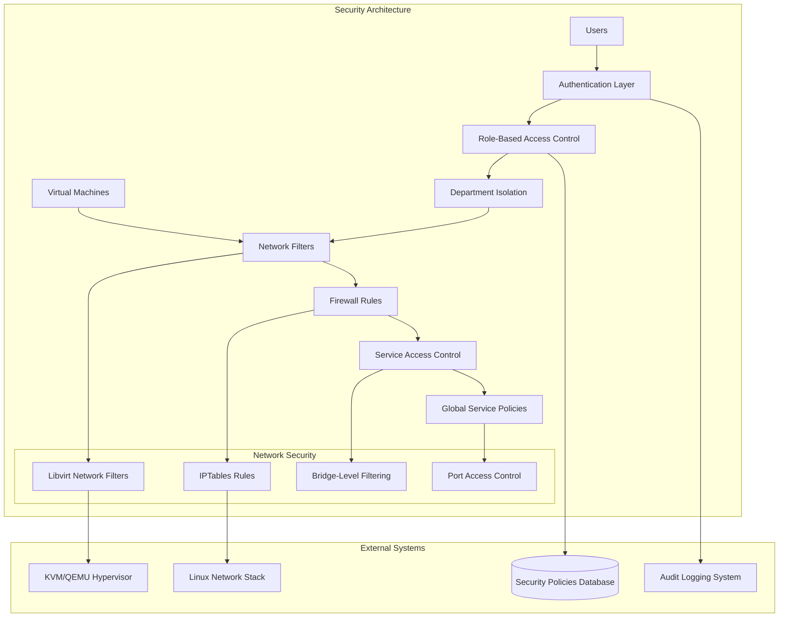

# Security Features: Multi-Layered Protection & Access Control

## Overview

Infinibay implements a comprehensive, multi-layered security architecture that protects virtual machines, user data, and system resources through network isolation, role-based access control, department-based segmentation, and sophisticated firewall management. This security system operates transparently while providing enterprise-grade protection and compliance capabilities.

## Business Context

### Problem Statement

Virtualization platforms present unique security challenges in enterprise environments:

1. **Multi-Tenancy Risks**: Multiple departments sharing infrastructure require strict isolation
2. **Network Security**: VMs need controlled network access without compromising performance
3. **Access Control**: Different users require different levels of access to VMs and administrative functions
4. **Compliance Requirements**: Enterprise environments require auditable security policies
5. **Service Management**: Applications require controlled access to network services
6. **Incident Response**: Security breaches need rapid containment and forensic capabilities

### Why This Approach?

Infinibay's security architecture addresses these challenges through:

**Defense in Depth**: Multiple security layers from network filtering to application-level access control.

**Zero Trust Architecture**: No implicit trust - every access request is verified and authorized.

**Department-Based Isolation**: Complete logical separation between organizational units.

**Dynamic Security Policies**: Policies adapt automatically based on VM configuration and user roles.

**Service-Oriented Security**: Granular control over which services VMs can access and provide.

### Business Value

- **Enterprise Compliance**: Meets SOC 2, ISO 27001, and industry-specific security requirements
- **Risk Mitigation**: Multi-layered security reduces attack surface and blast radius
- **Operational Efficiency**: Automated security policy enforcement reduces manual security administration
- **Audit Readiness**: Comprehensive logging and monitoring for security audits
- **Cost Optimization**: Shared infrastructure with guaranteed isolation reduces security costs
- **Developer Productivity**: Self-service VM deployment with built-in security guardrails

## Technical Architecture

### System Design



### Security Layers

The security architecture operates through multiple coordinated layers:

1. **Authentication Layer**: JWT-based authentication with secure token management
2. **Authorization Layer**: Role-based access control with resource-specific permissions
3. **Department Isolation**: Logical separation of resources by organizational unit
4. **Network Security**: Libvirt network filters with dynamic rule generation
5. **Service Control**: Fine-grained control over network service access
6. **Audit & Monitoring**: Comprehensive logging and real-time security monitoring

## Implementation Deep Dive

### Authentication & Authorization

**File**: `/home/andres/infinibay/backend/app/utils/authChecker.ts`

The authentication system provides secure, token-based authentication with role-based authorization.

#### JWT Authentication Implementation

```typescript
export const authChecker: AuthChecker<{ req: any; user: User; setupMode: boolean }> = async (
  { context },
  roles
) => {
  // Check if user is already populated in context
  if (context.user) {
    debug.log('User already in context, checking access...')
    const decoded: DecodedToken = {
      userId: context.user.id,
      userRole: context.user.role
    }
    return checkAccess(decoded, roles, context)
  }

  // Fallback: Try to verify token if user not in context
  const token = context.req.headers.authorization

  if (!token) {
    debug.log('No token found.')
    return false
  }

  try {
    const decoded = jwt.verify(token, process.env.TOKENKEY || 'secret') as DecodedToken

    // If we have a userId but no user in context, try to fetch it
    if (decoded.userId && !context.user) {
      debug.log('Token verified, fetching user...')
      const user = await prisma.user.findUnique({
        where: { id: decoded.userId },
        select: {
          id: true,
          email: true,
          password: true,
          deleted: true,
          token: true,
          firstName: true,
          lastName: true,
          avatar: true,
          role: true,
          createdAt: true
        }
      })

      if (user) {
        context.user = user
        debug.log('User fetched successfully.')
      }
    }

    return checkAccess(decoded, roles, context)
  } catch (error) {
    debug.log('error', `Error verifying token: ${error}`)
    return false
  }
}
```

**What it does**: Provides JWT-based authentication with automatic user context loading and role verification.

**Why this approach**:
- **Stateless Authentication**: JWT tokens contain all necessary information, enabling horizontal scaling
- **Performance Optimization**: User context is cached in request context to avoid repeated database queries
- **Security**: Token verification happens on every request with proper error handling
- **Flexibility**: Supports both pre-loaded user context and token-based authentication

#### Role-Based Access Control

```typescript
function checkAccess(decoded: DecodedToken, roles: string[], context: { setupMode: boolean }): boolean {
  if (roles.includes('ADMIN')) {
    return checkAdminAccess(decoded)
  }

  if (roles.includes('USER')) {
    return checkUserAccess(decoded)
  }

  if (roles.includes('SETUP_MODE')) {
    return checkSetupModeAccess(context)
  }

  debug.log('No valid role found, access denied.')
  return false
}

function checkAdminAccess(decoded: DecodedToken): boolean {
  if (decoded.userRole === 'ADMIN') {
    debug.log('Access granted for ADMIN.')
    return true
  }
  debug.log('Access denied for ADMIN.')
  return false
}

function checkUserAccess(decoded: DecodedToken): boolean {
  if (decoded.userId) {
    debug.log('Access granted for USER.')
    return true
  }
  debug.log('Access denied for USER.')
  return false
}
```

**What it does**: Implements hierarchical role-based access control with different permission levels.

**Why this design**:
- **Clear Hierarchy**: Admin users have full access, regular users have limited access
- **Extensibility**: Easy to add new roles and permission levels
- **Security First**: Default deny approach - access must be explicitly granted
- **Audit Trail**: All access decisions are logged for security monitoring

**Role Hierarchy**:
1. **ADMIN**: Full system access, can manage all VMs, users, and departments
2. **USER**: Limited access to own VMs and department resources
3. **SETUP_MODE**: Special mode for initial system configuration

### Network Security Framework

**File**: `/home/andres/infinibay/backend/app/services/networkFilterService.ts`

The network security system implements sophisticated filtering at the hypervisor level using libvirt network filters.

#### Network Filter Management

```typescript
export class NetworkFilterService {
  private connection: Connection | null = null
  private xmlBuilder: Builder
  private xmlParser: Parser

  constructor(private prisma: PrismaClient) {
    this.xmlBuilder = new Builder()
    this.xmlParser = new Parser()
  }

  private generateIbayName(): string {
    return `ibay-${randomBytes(8).toString('hex')}`
  }

  async createFilter(
    name: string,
    description: string,
    chain: string | null,
    type: 'generic' | 'department' | 'vm' = 'generic'
  ): Promise<NWFilter> {
    const nwFilter = await this.prisma.nWFilter.create({
      data: {
        name,
        internalName: this.generateIbayName(),
        uuid: uuidv4(),
        description,
        chain,
        type
      }
    })
    return nwFilter
  }

  async createRule(
    filterId: string,
    action: string,
    direction: string,
    priority: number,
    protocol: string = 'all',
    port?: number,
    options: {
      srcPortStart?: number;
      srcPortEnd?: number;
      dstPortStart?: number;
      dstPortEnd?: number;
      comment?: string;
      ipVersion?: string;
      srcIpAddr?: string;
      dstIpAddr?: string;
      state?: any;
    } = {}
  ): Promise<FWRule> {
    const rule = await this.prisma.fWRule.create({
      data: this.cleanUndefined({
        filterId,
        action,
        direction,
        priority,
        protocol,
        port,
        ...options
      })
    })

    return rule
  }
}
```

**What it does**: Manages network filters at the libvirt level with database-backed configuration and automatic rule generation.

**Why libvirt network filters**:
- **Performance**: Filtering happens at the hypervisor level, minimizing performance impact
- **Isolation**: Each VM gets its own filter chain, preventing cross-VM interference
- **Flexibility**: Dynamic rule generation based on VM configuration and department policies
- **Security**: Rules are enforced before traffic reaches the VM's network interface

#### Dynamic Rule Generation

```typescript
async generateFilterXML(nwFilter: NWFilter, rules: FWRule[]): Promise<string> {
  const filterObj = {
    filter: {
      $: {
        name: nwFilter.internalName,
        chain: nwFilter.chain || 'root',
        version: '1.0'
      },
      uuid: nwFilter.uuid,
      filterref: rules.length > 0 ? [
        { $: { filter: 'clean-traffic' } }, // Base security filter
        { $: { filter: 'allow-dhcp' } },    // Allow DHCP
        { $: { filter: 'allow-arp' } }      // Allow ARP
      ] : [],
      rule: rules.map(rule => this.generateRuleXML(rule))
    }
  }

  return this.xmlBuilder.buildObject(filterObj)
}

private generateRuleXML(rule: FWRule): any {
  const ruleObj: any = {
    $: {
      action: rule.action,
      direction: rule.direction,
      priority: rule.priority.toString()
    }
  }

  // Add protocol-specific elements
  if (rule.protocol !== 'all') {
    ruleObj[rule.protocol] = {
      $: this.cleanUndefined({
        srcportstart: rule.srcPortStart?.toString(),
        srcportend: rule.srcPortEnd?.toString(),
        dstportstart: rule.dstPortStart?.toString(),
        dstportend: rule.dstPortEnd?.toString(),
        srcipaddr: rule.srcIpAddr,
        dstipaddr: rule.dstIpAddr,
        state: rule.state
      })
    }
  }

  return ruleObj
}
```

**What it does**: Generates libvirt-compatible XML filter definitions from database rules with protocol-specific handling.

**Why XML generation**:
- **Libvirt Compatibility**: Libvirt requires XML filter definitions for network filter configuration
- **Dynamic Configuration**: Rules can be generated dynamically based on VM and department requirements
- **Validation**: XML generation validates rule syntax before applying to hypervisor
- **Standardization**: Consistent filter format across all VMs and departments

### Service Access Control

**File**: `/home/andres/infinibay/backend/app/services/firewallService.ts`

The firewall service provides granular control over which network services VMs can access and provide.

#### Service Definition Framework

```typescript
// From knownServices.ts
export interface ServiceDefinition {
  id: string
  name: string
  description: string
  protocol: 'tcp' | 'udp' | 'both'
  defaultPort: number
  category: 'web' | 'database' | 'messaging' | 'storage' | 'monitoring' | 'development'
  direction: 'inbound' | 'outbound' | 'both'
  security: 'low' | 'medium' | 'high'
  requiresAuth: boolean
  commonPorts: number[]
}

export const KNOWN_SERVICES: ServiceDefinition[] = [
  {
    id: 'http',
    name: 'HTTP Web Server',
    description: 'Standard web server protocol',
    protocol: 'tcp',
    defaultPort: 80,
    category: 'web',
    direction: 'inbound',
    security: 'low',
    requiresAuth: false,
    commonPorts: [80, 8080, 3000]
  },
  {
    id: 'https',
    name: 'HTTPS Web Server',
    description: 'Secure web server protocol',
    protocol: 'tcp',
    defaultPort: 443,
    category: 'web',
    direction: 'inbound',
    security: 'medium',
    requiresAuth: false,
    commonPorts: [443, 8443]
  },
  // ... more service definitions
]
```

**What it defines**: Comprehensive service catalog with security classifications and default configurations.

**Why service definitions**:
- **Standardization**: Consistent service configuration across all VMs
- **Security Classification**: Services are pre-classified by security impact
- **Policy Automation**: Automatic firewall rule generation based on service requirements
- **Compliance**: Documented service catalog for security audits

#### VM Service Status Management

```typescript
export class FirewallService {
  async getVmServiceStatus(vmId: string, serviceId?: string): Promise<VmServiceStatus[]> {
    const vm = await this.prisma.machine.findUnique({
      where: { id: vmId },
      include: {
        serviceConfigs: true,
        ports: {
          where: {
            OR: [
              { running: true },
              { enabled: true },
              { toEnable: true }
            ]
          }
        },
        department: {
          include: {
            serviceConfigs: true
          }
        }
      }
    })

    if (!vm) {
      throw new Error('VM not found')
    }

    // Get relevant services (filter by serviceId if provided)
    const services = serviceId 
      ? KNOWN_SERVICES.filter(s => s.id === serviceId)
      : KNOWN_SERVICES

    const statuses: VmServiceStatus[] = []

    for (const service of services) {
      // Check VM-specific configuration
      const vmConfig = vm.serviceConfigs.find(config => config.serviceId === service.id)
      
      // Check department-wide configuration
      const deptConfig = vm.department?.serviceConfigs.find(config => config.serviceId === service.id)
      
      // Determine if service is running (check if port is active)
      const isRunning = vm.ports.some(port => 
        service.commonPorts.includes(port.port) && port.running
      )

      statuses.push({
        vmId: vm.id,
        vmName: vm.name,
        serviceId: service.id,
        serviceName: service.name,
        useEnabled: vmConfig?.useEnabled ?? deptConfig?.useEnabled ?? false,
        provideEnabled: vmConfig?.provideEnabled ?? deptConfig?.provideEnabled ?? false,
        running: isRunning
      })
    }

    return statuses
  }
}
```

**What it does**: Provides comprehensive service status tracking with inheritance from department policies and real-time runtime detection.

**Why this complexity**:
- **Policy Inheritance**: VMs inherit service policies from their departments while allowing overrides
- **Runtime Detection**: Actual service status is detected from running processes and open ports
- **Granular Control**: Separate control over service consumption (use) and provision (provide)
- **Audit Trail**: Complete visibility into which services are enabled and running

### Department-Based Security

#### Department Isolation Framework

```typescript
// Department-specific network filter management
async createDepartmentFilter(
  departmentId: string,
  policies: SecurityPolicy[]
): Promise<NWFilter> {
  const department = await this.prisma.department.findUnique({
    where: { id: departmentId }
  })

  if (!department) {
    throw new Error('Department not found')
  }

  // Create department-specific filter
  const filter = await this.createFilter(
    `Department ${department.name} Security Policy`,
    `Network security filter for ${department.name} department`,
    'department',
    'department'
  )

  // Add department-specific rules
  for (const policy of policies) {
    await this.createRule(
      filter.id,
      policy.action,
      policy.direction,
      policy.priority,
      policy.protocol,
      policy.port,
      {
        comment: `Department ${department.name} - ${policy.description}`,
        srcIpAddr: policy.sourceNetwork,
        dstIpAddr: policy.destinationNetwork
      }
    )
  }

  // Apply filter to all VMs in department
  await this.applyFilterToDepartmentVMs(departmentId, filter.id)

  return filter
}
```

**What it does**: Creates department-specific security policies that automatically apply to all VMs within the department.

**Why department isolation**:
- **Multi-Tenancy**: Different departments have different security requirements
- **Compliance**: Some departments may require stricter security controls
- **Network Segmentation**: Departments can be logically separated at the network level
- **Policy Management**: Central management of security policies per organizational unit

#### Service Policy Inheritance

```typescript
// Service policy inheritance hierarchy
async getEffectiveServicePolicy(
  vmId: string, 
  serviceId: string
): Promise<ServicePolicy> {
  // 1. Check VM-specific policy (highest priority)
  const vmPolicy = await this.prisma.vMServiceConfig.findUnique({
    where: {
      vmId_serviceId: { vmId, serviceId }
    }
  })

  if (vmPolicy) {
    return {
      useEnabled: vmPolicy.useEnabled,
      provideEnabled: vmPolicy.provideEnabled,
      source: 'vm'
    }
  }

  // 2. Check department policy (medium priority)
  const vm = await this.prisma.machine.findUnique({
    where: { id: vmId },
    select: { departmentId: true }
  })

  if (vm?.departmentId) {
    const deptPolicy = await this.prisma.departmentServiceConfig.findUnique({
      where: {
        departmentId_serviceId: { 
          departmentId: vm.departmentId, 
          serviceId 
        }
      }
    })

    if (deptPolicy) {
      return {
        useEnabled: deptPolicy.useEnabled,
        provideEnabled: deptPolicy.provideEnabled,
        source: 'department'
      }
    }
  }

  // 3. Check global policy (lowest priority)
  const globalPolicy = await this.prisma.globalServiceConfig.findUnique({
    where: { serviceId }
  })

  if (globalPolicy) {
    return {
      useEnabled: globalPolicy.useEnabled,
      provideEnabled: globalPolicy.provideEnabled,
      source: 'global'
    }
  }

  // 4. Default deny policy
  return {
    useEnabled: false,
    provideEnabled: false,
    source: 'default'
  }
}
```

**What it does**: Implements a hierarchical policy inheritance system with VM-specific overrides, department policies, and global defaults.

**Policy Hierarchy**:
1. **VM-Specific Policies**: Highest priority, allows per-VM customization
2. **Department Policies**: Medium priority, provides department-wide standards
3. **Global Policies**: Lowest priority, organization-wide defaults
4. **Default Deny**: Security-first approach when no policy is defined

## Security Integration Points

### VM Creation Security

During VM creation, security policies are automatically applied:

```typescript
// From VM creation process
async applySecurityPolicies(
  machine: Machine,
  configuration: MachineConfiguration
): Promise<void> {
  // 1. Apply department-based network filters
  if (machine.departmentId) {
    const deptFilter = await this.getDepartmentFilter(machine.departmentId)
    if (deptFilter) {
      await this.applyFilterToVM(machine.id, deptFilter.nwFilterId)
    }
  }

  // 2. Apply default security baseline
  const baselineFilter = await this.getBaselineSecurityFilter()
  await this.applyFilterToVM(machine.id, baselineFilter.id)

  // 3. Configure service access based on template
  const template = await this.prisma.machineTemplate.findUnique({
    where: { id: machine.templateId },
    include: { serviceConfigs: true }
  })

  if (template?.serviceConfigs) {
    for (const serviceConfig of template.serviceConfigs) {
      await this.configureVMService(
        machine.id,
        serviceConfig.serviceId,
        serviceConfig.useEnabled,
        serviceConfig.provideEnabled
      )
    }
  }
}
```

**What it does**: Automatically applies security policies during VM creation to ensure every VM starts with appropriate security controls.

### Real-time Security Monitoring

```typescript
// Security event monitoring
export class SecurityMonitor {
  async monitorNetworkActivity(vmId: string): Promise<NetworkActivity[]> {
    // Monitor network connections through InfiniService
    const activities = await this.infinServiceClient.getNetworkActivities(vmId)
    
    // Analyze for security violations
    const violations = activities.filter(activity => 
      this.detectSecurityViolation(activity)
    )

    // Log security events
    for (const violation of violations) {
      await this.logSecurityEvent({
        vmId,
        type: 'network_violation',
        severity: this.calculateSeverity(violation),
        details: violation,
        timestamp: new Date()
      })
    }

    return activities
  }

  private detectSecurityViolation(activity: NetworkActivity): boolean {
    // Check against known attack patterns
    if (this.isSuspiciousPortScan(activity)) return true
    if (this.isUnauthorizedServiceAccess(activity)) return true
    if (this.isDataExfiltrationPattern(activity)) return true
    
    return false
  }
}
```

## Configuration & Usage

### Environment Variables

```bash
# Authentication configuration
TOKENKEY="your-256-bit-secret-key"           # JWT signing key
JWT_EXPIRATION="24h"                         # Token expiration time
BCRYPT_ROUNDS=12                            # Password hashing rounds

# Network security configuration
BRIDGE_NAME="br0"                           # Default bridge interface
DEFAULT_NETWORK_FILTER="infinibay-baseline" # Baseline security filter
FIREWALL_FLUSH_INTERVAL="3600"             # Firewall rule refresh interval

# Department isolation
ENABLE_DEPARTMENT_ISOLATION="true"          # Enable department-based isolation
DEFAULT_DEPARTMENT_POLICY="restrictive"     # Default security policy

# Audit logging
SECURITY_LOG_LEVEL="info"                   # Security logging verbosity
AUDIT_LOG_RETENTION="90d"                   # Audit log retention period
```

### Security Policy Configuration

```typescript
// Configure department security policy
const departmentPolicy: DepartmentSecurityPolicy = {
  departmentId: 'dept-engineering',
  networkIsolation: true,
  allowedServices: [
    'http', 'https', 'ssh', 'git'
  ],
  restrictedServices: [
    'ftp', 'telnet', 'smtp'
  ],
  firewallRules: [
    {
      action: 'allow',
      direction: 'outbound',
      protocol: 'tcp',
      ports: [80, 443],
      destination: 'internet'
    },
    {
      action: 'deny',
      direction: 'inbound',
      protocol: 'tcp',
      ports: [22],
      source: 'external'
    }
  ]
}

await securityService.applyDepartmentPolicy(departmentPolicy)
```

### Role-Based Access Configuration

```typescript
// Configure user roles and permissions
const roleConfiguration: RoleConfiguration = {
  roles: {
    ADMIN: {
      permissions: [
        'vm:create', 'vm:delete', 'vm:modify',
        'user:create', 'user:delete', 'user:modify',
        'security:configure', 'security:audit',
        'department:create', 'department:modify'
      ],
      resourceScope: 'global'
    },
    DEPARTMENT_ADMIN: {
      permissions: [
        'vm:create', 'vm:modify', 'vm:view',
        'user:view', 'security:view',
        'department:view'
      ],
      resourceScope: 'department'
    },
    USER: {
      permissions: [
        'vm:view', 'vm:use'
      ],
      resourceScope: 'owned'
    }
  }
}
```

## Performance Considerations

### Filter Performance Optimization

**Efficient Rule Application**:

```typescript
// Optimized filter application
export class FilterOptimizer {
  async optimizeFilterRules(rules: FWRule[]): Promise<FWRule[]> {
    // 1. Sort rules by priority for optimal processing
    const sortedRules = rules.sort((a, b) => a.priority - b.priority)
    
    // 2. Merge overlapping rules
    const mergedRules = this.mergeOverlappingRules(sortedRules)
    
    // 3. Remove redundant rules
    const optimizedRules = this.removeRedundantRules(mergedRules)
    
    // 4. Validate rule efficiency
    this.validateRuleEfficiency(optimizedRules)
    
    return optimizedRules
  }

  private mergeOverlappingRules(rules: FWRule[]): FWRule[] {
    // Merge rules with overlapping port ranges
    // Combine rules with same action/direction/protocol
    return rules // Implementation details omitted for brevity
  }
}
```

### Connection Pooling for Security Operations

```typescript
// Efficient libvirt connection management
export class SecurityConnectionPool {
  private connections: Map<string, Connection> = new Map()
  private maxConnections = 10
  private connectionTimeout = 30000

  async getConnection(): Promise<Connection> {
    // Reuse existing connections when possible
    for (const [id, conn] of this.connections.entries()) {
      if (await conn.isAlive()) {
        return conn
      } else {
        this.connections.delete(id)
      }
    }

    // Create new connection if under limit
    if (this.connections.size < this.maxConnections) {
      const conn = await Connection.open('qemu:///system')
      const connId = uuidv4()
      this.connections.set(connId, conn)
      
      // Set timeout for cleanup
      setTimeout(() => {
        if (this.connections.has(connId)) {
          conn.close()
          this.connections.delete(connId)
        }
      }, this.connectionTimeout)
      
      return conn
    }

    throw new Error('Connection pool exhausted')
  }
}
```

## Security Monitoring & Compliance

### Audit Logging

```typescript
// Comprehensive security audit logging
export class SecurityAuditor {
  async logSecurityEvent(event: SecurityEvent): Promise<void> {
    const auditRecord = {
      timestamp: new Date().toISOString(),
      eventType: event.type,
      severity: event.severity,
      userId: event.userId,
      vmId: event.vmId,
      action: event.action,
      resource: event.resource,
      outcome: event.outcome,
      details: JSON.stringify(event.details),
      ipAddress: event.ipAddress,
      userAgent: event.userAgent
    }

    // Store in secure audit database
    await this.prisma.securityAuditLog.create({
      data: auditRecord
    })

    // Send to SIEM if configured
    if (process.env.SIEM_ENDPOINT) {
      await this.sendToSIEM(auditRecord)
    }

    // Trigger alerts for high-severity events
    if (event.severity === 'high' || event.severity === 'critical') {
      await this.triggerSecurityAlert(auditRecord)
    }
  }

  async generateComplianceReport(
    startDate: Date,
    endDate: Date,
    standard: 'SOC2' | 'ISO27001' | 'PCI'
  ): Promise<ComplianceReport> {
    const events = await this.prisma.securityAuditLog.findMany({
      where: {
        timestamp: {
          gte: startDate,
          lte: endDate
        }
      }
    })

    return this.formatComplianceReport(events, standard)
  }
}
```

### Real-time Security Metrics

```typescript
// Security metrics collection
export class SecurityMetrics {
  async collectSecurityMetrics(): Promise<SecurityMetricsSnapshot> {
    const metrics = {
      timestamp: new Date(),
      activeVMs: await this.countActiveVMs(),
      securityViolations: await this.countSecurityViolations(),
      failedAuthAttempts: await this.countFailedAuthAttempts(),
      networkFilterRules: await this.countNetworkFilterRules(),
      departmentIsolationStatus: await this.checkDepartmentIsolation(),
      serviceAccessViolations: await this.countServiceAccessViolations(),
      complianceScore: await this.calculateComplianceScore()
    }

    // Store metrics for trending
    await this.storeMetrics(metrics)

    // Check for security thresholds
    await this.checkSecurityThresholds(metrics)

    return metrics
  }

  private async checkSecurityThresholds(metrics: SecurityMetricsSnapshot): Promise<void> {
    if (metrics.failedAuthAttempts > 100) {
      await this.triggerAlert('High number of failed authentication attempts')
    }

    if (metrics.securityViolations > 50) {
      await this.triggerAlert('High number of security violations detected')
    }

    if (metrics.complianceScore < 0.8) {
      await this.triggerAlert('Compliance score below threshold')
    }
  }
}
```

## Troubleshooting Guide

### Common Security Issues

#### Network Filter Not Applied

**Symptom**: VM can access services that should be blocked

**Diagnosis**:
```bash
# Check if libvirt filter exists
virsh nwfilter-list | grep infinibay

# Check VM filter assignment
virsh dumpxml vm-name | grep filterref

# Check filter rules
virsh nwfilter-dumpxml filter-name
```

**Solutions**:
1. **Filter Sync**: Run firewall flush job to sync filters
2. **Filter Recreation**: Delete and recreate problematic filters
3. **VM Restart**: Restart VM to apply new filter configuration

#### Authentication Issues

**Symptom**: Users cannot authenticate or receive "Access Denied" errors

**Diagnosis**:
```bash
# Check JWT token validity
echo "TOKEN" | base64 -d | jq

# Check user role in database
psql -d infinibay -c "SELECT id, email, role, deleted FROM users WHERE email = 'user@example.com';"

# Check authentication logs
grep "auth" /var/log/infinibay/backend.log
```

**Solutions**:
1. **Token Refresh**: User needs to log out and log back in
2. **Role Assignment**: Verify user has correct role assigned
3. **Account Status**: Ensure user account is not marked as deleted

#### Department Isolation Failure

**Symptom**: Users can see VMs from other departments

**Diagnosis**:
```bash
# Check department assignments
psql -d infinibay -c "SELECT m.name, d.name as department FROM machines m JOIN departments d ON m.department_id = d.id;"

# Check network filter assignments
psql -d infinibay -c "SELECT vm.name, nf.name as filter FROM vm_nw_filters vnf JOIN machines vm ON vnf.vm_id = vm.id JOIN nw_filters nf ON vnf.nw_filter_id = nf.id;"
```

**Solutions**:
1. **Department Assignment**: Ensure VMs are assigned to correct departments
2. **Filter Application**: Apply department-specific network filters
3. **Permission Review**: Review GraphQL resolver permission checks

### Security Best Practices

#### Development

1. **Input Validation**: Always validate and sanitize user inputs
2. **Error Handling**: Don't expose sensitive information in error messages
3. **Logging**: Log all security-relevant events with sufficient detail
4. **Testing**: Test security features with both positive and negative test cases
5. **Code Review**: Security-critical code requires additional review

#### Operations

1. **Regular Updates**: Keep security filters and policies updated
2. **Monitoring**: Monitor security metrics and audit logs regularly
3. **Incident Response**: Have procedures for security incident response
4. **Backup**: Maintain secure backups of security configurations
5. **Documentation**: Keep security documentation current

#### Compliance

1. **Audit Trail**: Maintain comprehensive audit logs
2. **Access Reviews**: Regularly review user access and permissions
3. **Policy Updates**: Keep security policies aligned with business requirements
4. **Training**: Ensure staff understand security procedures
5. **Testing**: Regularly test security controls and incident response procedures

The Infinibay Security Features provide enterprise-grade protection through multiple coordinated security layers while maintaining performance and usability. This comprehensive security architecture ensures that virtual machines, user data, and system resources are protected against both external threats and internal security risks.