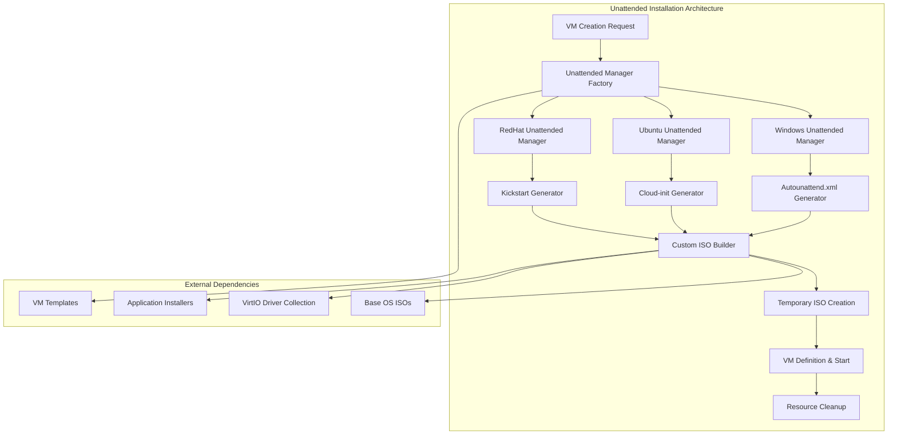

# Unattended Installation: Automated OS Deployment

## Overview

The Infinibay Unattended Installation system automates the complete operating system installation process, transforming what traditionally requires manual intervention into a fully automated, reproducible workflow. This system generates custom installation media with embedded configurations, enabling zero-touch deployment of Windows, Ubuntu, and Red Hat-based operating systems.

## Business Context

### Problem Statement

Traditional VM deployment faces several critical challenges:

1. **Manual Labor Intensive**: Each VM requires manual OS installation, taking 30-60 minutes per machine
2. **Inconsistent Configuration**: Manual installs lead to configuration drift and security gaps  
3. **Scaling Bottlenecks**: Manual processes don't scale to enterprise deployment needs
4. **Human Error**: Manual configurations are prone to mistakes and omissions
5. **Time-to-Deployment**: Business units wait hours or days for new development environments

### Why This Approach?

Infinibay's unattended installation system solves these problems through:

**Automated Configuration Generation**: Creates OS-specific answer files (autounattend.xml, kickstart, cloud-init) with user credentials, network settings, and application installations.

**Custom ISO Creation**: Dynamically generates installation media with embedded configurations, eliminating the need for network-based configuration servers.

**OS-Agnostic Architecture**: Unified interface supporting Windows (10/11), Ubuntu, and Red Hat/Fedora with extensible design for additional operating systems.

**Integration with VM Lifecycle**: Seamlessly integrates with the VM creation process, automatically cleaning up temporary resources.

### Business Value

- **10x Faster Deployment**: VMs ready in 5-15 minutes vs 30-60 minutes manual
- **100% Consistency**: Identical configurations across all deployments
- **Zero Human Intervention**: Complete automation from request to running VM
- **Cost Reduction**: Eliminates manual deployment labor costs
- **Compliance**: Standardized configurations ensure security and compliance policies
- **Developer Productivity**: Self-service VM deployment for development teams

## Technical Architecture

### System Design



### Component Relationships

The unattended installation system operates through a sophisticated factory pattern that adapts to different operating systems while maintaining a consistent interface:

1. **Unattended Manager Base**: Abstract foundation providing common functionality
2. **OS-Specific Managers**: Concrete implementations for Windows, Ubuntu, and Red Hat
3. **Configuration Generators**: Create OS-specific answer files with user customizations
4. **ISO Building Pipeline**: Combines base ISOs with generated configurations
5. **Resource Management**: Handles temporary files and cleanup operations

## Implementation Deep Dive

### Unattended Manager Factory Pattern

**File**: `/home/andres/infinibay/backend/app/utils/VirtManager/createMachineService.ts`

```typescript
private createUnattendedManager(
  machine: Machine, 
  username: string, 
  password: string, 
  productKey: string | undefined, 
  applications: any[]
): UnattendedManagerBase {
  const osManagers = {
    windows10: () => new UnattendedWindowsManager(10, username, password, productKey, applications, machine.id),
    windows11: () => new UnattendedWindowsManager(11, username, password, productKey, applications, machine.id),
    ubuntu: () => new UnattendedUbuntuManager(username, password, applications, machine.id),
    fedora: () => new UnattendedRedHatManager(username, password, applications, machine.id),
    redhat: () => new UnattendedRedHatManager(username, password, applications, machine.id)
  }

  const managerCreator = osManagers[machine.os as keyof typeof osManagers]
  if (!managerCreator) {
    throw new Error(`Unsupported OS: ${machine.os}`)
  }

  return managerCreator()
}
```

**What it does**: Creates the appropriate unattended manager based on the target operating system.

**Why this pattern**:
- **Extensibility**: Easy to add new operating systems without modifying existing code
- **Type Safety**: TypeScript ensures only valid OS types are processed
- **Dependency Injection**: Each manager receives exactly the dependencies it needs
- **Single Responsibility**: Each manager focuses on one operating system's specifics

**What for**: Provides a unified interface for OS installation while accommodating the unique requirements of each operating system.

### Windows Unattended Installation

**File**: `/home/andres/infinibay/backend/app/services/unattendedWindowsManager.ts`

The Windows unattended manager generates sophisticated `autounattend.xml` files that automate the entire Windows installation and configuration process.

#### Core Configuration Structure

```typescript
export class UnattendedWindowsManager extends UnattendedManagerBase {
  private static readonly COMPONENT_BASE_CONFIG: ComponentConfig = {
    name: 'Microsoft-Windows-Shell-Setup',
    processorArchitecture: 'amd64',
    publicKeyToken: '31bf3856ad364e35',
    language: 'neutral',
    versionScope: 'nonSxS',
    xmlns: 'http://schemas.microsoft.com/WMIConfig/2002/State'
  }

  constructor(
    version: number,
    username: string,
    password: string,
    productKey: string | undefined,
    applications: any[],
    vmId?: string
  ) {
    super()
    this.configFileName = 'autounattend.xml'
    this.version = version
    this.username = username
    this.password = password
    this.productKey = productKey
    this.applications = applications
    this.vmId = vmId || ''
    this.isoPath = path.join(
      process.env.INFINIBAY_BASE_DIR ?? '/opt/infinibay', 
      'iso', 
      `windows${this.version.toString()}.iso`
    )
  }
}
```

**What it does**: Initializes Windows-specific configuration with version, credentials, and application requirements.

**Why this structure**:
- **Version Awareness**: Different Windows versions require different configurations
- **Credential Security**: Passwords are embedded securely in the answer file
- **Application Integration**: Applications are installed automatically during first boot
- **Component Standardization**: Uses Microsoft's standard component configuration format

#### First Logon Commands Generation

```typescript
private getFirstLogonCommands(): any[] {
  let commands = [
    {
      $: { 'wcm:action': 'add' },
      Description: 'Control Panel View',
      Order: 1,
      CommandLine: 'reg add "HKEY_CURRENT_USER\\Software\\Microsoft\\Windows\\CurrentVersion\\Explorer\\ControlPanel" /v StartupPage /t REG_DWORD /d 1 /f',
      RequiresUserInput: true
    },
    {
      $: { 'wcm:action': 'add' },
      Order: 2,
      Description: 'Control Panel Icon Size',
      RequiresUserInput: false,
      CommandLine: 'reg add "HKEY_CURRENT_USER\\Software\\Microsoft\\Windows\\CurrentVersion\\Explorer\\ControlPanel" /v AllItemsIconView /t REG_DWORD /d 0 /f'
    },
    {
      $: { 'wcm:action': 'add' },
      Order: 3,
      RequiresUserInput: false,
      CommandLine: `cmd /C wmic useraccount where name="${this.username}" set PasswordExpires=false`,
      Description: 'Password Never Expires'
    },
    {
      $: { 'wcm:action': 'add' },
      Order: 4,
      Description: 'Install Virtio Drivers',
      RequiresUserInput: false,
      CommandLine: 'msiexec /i E:\\virtio-win-gt-x64.msi /quiet /norestart'
    }
  ]

  // Add application installation commands
  this.applications.forEach((app, index) => {
    commands.push({
      $: { 'wcm:action': 'add' },
      Order: commands.length + 1,
      Description: `Install ${app.name}`,
      RequiresUserInput: false,
      CommandLine: this.generateInstallCommand(app)
    })
  })

  return commands
}
```

**What it does**: Generates a sequence of commands that execute automatically after Windows first boot.

**Why this approach**:
- **Ordered Execution**: Commands run in specific sequence to handle dependencies
- **User Experience**: Configures Windows for optimal user experience (Control Panel view, etc.)
- **Security Configuration**: Sets password policies and user account settings
- **Driver Installation**: Automatically installs VirtIO drivers for optimal VM performance
- **Application Deployment**: Installs required applications without user intervention

**What for**: 
- **Complete Automation**: User receives a fully configured system
- **Standardization**: Consistent configuration across all Windows VMs
- **Performance**: VirtIO drivers ensure optimal I/O performance
- **Productivity**: Applications are ready to use immediately

#### Dynamic ISO Generation

```typescript
async generateNewImage(): Promise<string> {
  const tempDir = await this.createTempDirectory()
  const configPath = path.join(tempDir, this.configFileName)
  
  // Generate the autounattend.xml configuration
  const config = await this.generateConfig()
  await fs.writeFile(configPath, config)
  
  // Create new ISO with embedded configuration
  const outputPath = await this.buildCustomISO(tempDir)
  
  // Cleanup temporary directory
  await this.cleanupTempDirectory(tempDir)
  
  return outputPath
}
```

**What it does**: Creates a custom Windows installation ISO with embedded unattended configuration.

**Why dynamic generation**:
- **Unique Configurations**: Each VM gets customized credentials and applications
- **Security**: Temporary files are created and cleaned up securely
- **Resource Efficiency**: ISOs are generated on-demand and cleaned up after use
- **Flexibility**: Configuration can be modified per-VM without affecting base ISOs

### Ubuntu Unattended Installation

**File**: `/home/andres/infinibay/backend/app/services/unattendedUbuntuManager.ts`

Ubuntu installations use cloud-init for automated configuration, providing a modern, standardized approach to Linux system initialization.

#### Cloud-Init Configuration

```typescript
export class UnattendedUbuntuManager extends UnattendedManagerBase {
  async generateConfig(): Promise<string> {
    const cloudConfig = {
      '#cloud-config': true,
      
      // User configuration
      users: [
        {
          name: this.username,
          plain_text_passwd: this.password,
          shell: '/bin/bash',
          sudo: 'ALL=(ALL) NOPASSWD:ALL',
          groups: ['sudo', 'admin'],
          lock_passwd: false
        }
      ],
      
      // SSH configuration
      ssh_pwauth: true,
      disable_root: false,
      
      // Package management
      apt: {
        sources: this.generateAptSources()
      },
      
      packages: this.generatePackageList(),
      
      // System configuration
      timezone: 'UTC',
      locale: 'en_US.UTF-8',
      
      // Application installation
      runcmd: this.generateRunCommands()
    }
    
    return yaml.dump(cloudConfig)
  }
}
```

**What it does**: Generates a comprehensive cloud-init configuration for Ubuntu automated installation.

**Why cloud-init**:
- **Industry Standard**: Cloud-init is the de facto standard for Linux cloud initialization
- **Declarative Configuration**: Describes desired state rather than imperative commands
- **Module System**: Leverages cloud-init's modular architecture for different configuration aspects
- **Package Management**: Native integration with apt package manager
- **User Management**: Standardized user creation and privilege assignment

#### Package and Application Management

```typescript
private generatePackageList(): string[] {
  const basePackages = [
    'openssh-server',
    'curl',
    'wget',
    'vim',
    'htop',
    'git',
    'build-essential'
  ]
  
  // Add application-specific packages
  const appPackages = this.applications
    .filter(app => app.packageName)
    .map(app => app.packageName)
  
  return [...basePackages, ...appPackages]
}

private generateRunCommands(): string[] {
  const commands = [
    // Update system
    'apt update && apt upgrade -y',
    
    // Configure system services
    'systemctl enable ssh',
    'systemctl start ssh',
    
    // Install VirtIO guest agent
    'apt install -y qemu-guest-agent',
    'systemctl enable qemu-guest-agent',
    'systemctl start qemu-guest-agent'
  ]
  
  // Add application-specific installation commands
  this.applications.forEach(app => {
    if (app.installScript) {
      commands.push(app.installScript)
    }
  })
  
  return commands
}
```

**What it does**: Generates package lists and installation commands for Ubuntu systems.

**Why this structure**:
- **Base System**: Ensures essential tools are available
- **Application Integration**: Automatically installs requested applications
- **Service Management**: Properly configures and starts system services
- **Guest Integration**: Installs QEMU guest agent for host-guest communication

### Red Hat/Fedora Unattended Installation

**File**: `/home/andres/infinibay/backend/app/services/unattendedRedHatManager.ts`

Red Hat-based systems use Kickstart files for automated installation, providing powerful scripting capabilities for enterprise deployments.

#### Kickstart Configuration Generation

```typescript
export class UnattendedRedHatManager extends UnattendedManagerBase {
  async generateConfig(): Promise<string> {
    const kickstartConfig = `
#version=RHEL8
# System authorization information
auth --enableshadow --passalgo=sha512

# Use network installation
url --url="http://mirror.centos.org/centos/8/BaseOS/x86_64/os/"

# Keyboard layouts
keyboard --vckeymap=us --xlayouts='us'

# System language
lang en_US.UTF-8

# Network information
network --bootproto=dhcp --device=eth0 --onboot=on --ipv6=auto

# Root password
rootpw --iscrypted ${this.generatePasswordHash(this.password)}

# System services
services --enabled="chronyd,sshd,qemu-guest-agent"

# System timezone
timezone UTC --isUtc

# User creation
user --groups=wheel --name=${this.username} --password=${this.generatePasswordHash(this.password)} --iscrypted --gecos="${this.username}"

# Disk partitioning information
autopart --type=lvm

# Boot loader configuration
bootloader --append=" crashkernel=auto" --location=mbr

# Clear the Master Boot Record
zerombr

# Partition clearing information
clearpart --all --initlabel

# Package selection
%packages
@^minimal-environment
openssh-server
qemu-guest-agent
curl
wget
vim
htop
git
${this.generatePackageSection()}
%end

# Post-installation script
%post --log=/var/log/anaconda/post-install.log
${this.generatePostInstallScript()}
%end

# Reboot after installation
reboot
`
    return kickstartConfig
  }
}
```

**What it does**: Generates a comprehensive Kickstart configuration for Red Hat-based automated installation.

**Why Kickstart**:
- **Enterprise Focus**: Kickstart is designed for enterprise Red Hat deployments
- **Complete Automation**: Can specify every aspect of the installation
- **Security Integration**: Native support for encrypted passwords and security policies
- **Package Management**: Integrates with yum/dnf package managers
- **Post-Install Scripting**: Powerful scripting capabilities for custom configuration

#### Advanced Configuration Features

```typescript
private generatePostInstallScript(): string {
  return `
#!/bin/bash

# Configure sudo for user
echo "${this.username} ALL=(ALL) NOPASSWD:ALL" >> /etc/sudoers.d/${this.username}

# Configure SSH
sed -i 's/#PermitRootLogin yes/PermitRootLogin no/' /etc/ssh/sshd_config
sed -i 's/#PasswordAuthentication yes/PasswordAuthentication yes/' /etc/ssh/sshd_config

# Enable and start services
systemctl enable sshd
systemctl enable qemu-guest-agent
systemctl start qemu-guest-agent

# Install additional applications
${this.generateApplicationInstallCommands()}

# Configure firewall for SSH
firewall-cmd --permanent --add-service=ssh
firewall-cmd --reload

# Update system
dnf update -y

# Final system configuration
echo "Unattended installation completed successfully" > /var/log/infinibay-install.log
`
}
```

**What it does**: Provides post-installation scripting for advanced system configuration.

**Why post-install scripts**:
- **Security Hardening**: Configures SSH and firewall settings
- **Service Management**: Ensures critical services are enabled and running
- **Application Installation**: Installs applications that require post-OS setup
- **Compliance**: Applies enterprise security and configuration policies

## Configuration & Usage

### Environment Variables

The unattended installation system uses these environment variables:

```bash
# Base directory for ISO storage
INFINIBAY_BASE_DIR="/opt/infinibay"

# Temporary directory for ISO generation
INFINIBAY_ISO_TEMP_DIR="/opt/infinibay/iso/temp"

# VirtIO drivers path
VIRTIO_WIN_ISO_PATH="/var/lib/libvirt/driver/virtio-win-0.1.229.iso"

# Windows product keys (optional)
WINDOWS_10_PRODUCT_KEY="XXXXX-XXXXX-XXXXX-XXXXX-XXXXX"
WINDOWS_11_PRODUCT_KEY="XXXXX-XXXXX-XXXXX-XXXXX-XXXXX"

# Ubuntu mirror configuration
UBUNTU_MIRROR_URL="http://archive.ubuntu.com/ubuntu/"

# Red Hat/CentOS mirror configuration  
CENTOS_MIRROR_URL="http://mirror.centos.org/centos/8/BaseOS/x86_64/os/"
```

### ISO Management

The system expects base OS ISOs to be available:

```bash
# Required ISO files
/opt/infinibay/iso/windows10.iso
/opt/infinibay/iso/windows11.iso
/opt/infinibay/iso/ubuntu-20.04.iso
/opt/infinibay/iso/centos-8.iso
/opt/infinibay/iso/fedora-35.iso

# VirtIO drivers (for optimal VM performance)
/var/lib/libvirt/driver/virtio-win-0.1.229.iso
```

### Application Configuration

Applications can be configured for automatic installation:

```typescript
interface Application {
  id: string
  name: string
  description: string
  
  // Windows-specific
  windowsInstaller?: string  // Path to MSI/EXE installer
  windowsArguments?: string  // Installation arguments
  
  // Linux-specific
  packageName?: string       // Package manager package name
  debUrl?: string           // Direct .deb download URL
  rpmUrl?: string           // Direct .rpm download URL
  installScript?: string    // Custom installation script
  
  // Common
  downloadUrl?: string      // Download URL for installer
  checksum?: string         // SHA256 checksum for verification
}
```

### Integration with VM Creation

The unattended installation system integrates seamlessly with VM creation:

```typescript
// In CreateMachineService
async create(
  machine: Machine, 
  username: string, 
  password: string, 
  productKey: string | undefined, 
  pciBus: string | null
): Promise<boolean> {
  try {
    // Create unattended manager for the target OS
    const unattendedManager = this.createUnattendedManager(
      machine, 
      username, 
      password, 
      productKey, 
      applications
    )
    
    // Generate custom installation ISO
    const newIsoPath = await unattendedManager.generateNewImage()
    
    // Create VM with custom ISO attached
    const xmlGenerator = await this.generateXML(
      machine, 
      template, 
      configuration, 
      newIsoPath, 
      pciBus
    )
    
    // Start VM (which boots from custom ISO)
    const vm = await this.defineAndStartVM(xmlGenerator, machine)
    
    return true
  } catch (error) {
    // Cleanup on failure
    await this.rollback(machine, newIsoPath)
    throw error
  }
}
```

## Performance Considerations

### ISO Generation Performance

**Optimization Strategies**:

1. **Parallel Generation**: Multiple ISOs can be generated simultaneously
2. **Caching**: Base ISO components are cached to reduce regeneration time
3. **Temporary Storage**: Uses fast temporary storage for ISO building
4. **Resource Cleanup**: Aggressive cleanup prevents disk space exhaustion

```typescript
// Performance monitoring in ISO generation
const startTime = Date.now()
const isoPath = await unattendedManager.generateNewImage()
const generationTime = Date.now() - startTime

console.log(`ISO generated in ${generationTime}ms`)

// Typical performance metrics:
// Windows 10: 30-60 seconds
// Ubuntu: 15-30 seconds  
// CentOS: 20-40 seconds
```

### Memory Management

**Resource Efficiency**:

```typescript
// Efficient memory usage during ISO generation
async generateNewImage(): Promise<string> {
  let tempDir: string | null = null
  
  try {
    // Create temporary workspace
    tempDir = await this.createTempDirectory()
    
    // Generate configuration (small memory footprint)
    const config = await this.generateConfig()
    
    // Stream-based ISO building (doesn't load entire ISO in memory)
    const outputPath = await this.buildCustomISO(tempDir)
    
    return outputPath
    
  } finally {
    // Always cleanup temporary resources
    if (tempDir) {
      await this.cleanupTempDirectory(tempDir)
    }
  }
}
```

### Disk Space Management

**Storage Optimization**:

1. **Temporary File Cleanup**: Aggressive cleanup of temporary ISO files
2. **Space Monitoring**: Checks available disk space before ISO generation
3. **Compression**: Uses efficient compression for custom ISO generation
4. **Quota Management**: Respects disk quota limits

```typescript
// Disk space management
const availableSpace = await this.getAvailableDiskSpace()
const estimatedIsoSize = await this.estimateIsoSize()

if (availableSpace < estimatedIsoSize * 2) {
  throw new Error('Insufficient disk space for ISO generation')
}
```

## Security Considerations

### Credential Security

**Password Handling**:

```typescript
// Secure password hashing for Linux systems
private generatePasswordHash(password: string): string {
  const salt = crypto.randomBytes(16).toString('hex')
  const hash = crypto.pbkdf2Sync(password, salt, 10000, 64, 'sha512')
  return `$6$${salt}$${hash.toString('hex')}`
}

// Windows passwords are embedded in autounattend.xml
// This is secured through:
// 1. Temporary ISO files are created with restricted permissions
// 2. ISOs are deleted immediately after VM creation
// 3. Only the VM creation process has access to the temporary files
```

**Temporary File Security**:

```typescript
// Secure temporary file creation
async createTempDirectory(): Promise<string> {
  const tempDir = path.join(
    process.env.INFINIBAY_ISO_TEMP_DIR ?? '/tmp/infinibay-iso',
    `vm-${this.vmId}-${Date.now()}`
  )
  
  // Create with restricted permissions (700)
  await fs.mkdir(tempDir, { mode: 0o700, recursive: true })
  
  return tempDir
}
```

### Application Security

**Installer Verification**:

```typescript
// Verify application installers before inclusion
async verifyInstaller(app: Application): Promise<boolean> {
  if (app.checksum) {
    const actualChecksum = await this.calculateChecksum(app.installerPath)
    if (actualChecksum !== app.checksum) {
      throw new Error(`Checksum mismatch for ${app.name}`)
    }
  }
  
  // Additional security checks
  await this.scanForMalware(app.installerPath)
  
  return true
}
```

## Troubleshooting Guide

### Common Issues

#### ISO Generation Failures

**Symptom**: Custom ISO creation fails during VM creation

**Diagnosis**:
```bash
# Check available disk space
df -h /opt/infinibay/iso/temp

# Check base ISO availability
ls -la /opt/infinibay/iso/

# Check permissions
ls -la /opt/infinibay/iso/temp/

# Check logs
grep "generateNewImage" /var/log/infinibay/backend.log
```

**Solutions**:
1. **Disk Space**: Ensure adequate space for temporary ISO files
2. **Permissions**: Verify write permissions to temporary directory
3. **Base ISOs**: Ensure base OS ISOs are present and readable
4. **Dependencies**: Verify ISO building tools are installed

#### Windows Installation Failures

**Symptom**: Windows VM starts but installation fails

**Common Causes**:
1. **Product Key**: Invalid or missing Windows product key
2. **VirtIO Drivers**: Missing or incorrect VirtIO driver path
3. **Memory**: Insufficient RAM for Windows installation
4. **Autounattend Format**: Malformed XML configuration

**Diagnosis**:
```bash
# Check autounattend.xml generation
cat /opt/infinibay/iso/temp/vm-*/autounattend.xml

# Validate XML format
xmllint --noout /opt/infinibay/iso/temp/vm-*/autounattend.xml

# Check VirtIO drivers
ls -la /var/lib/libvirt/driver/virtio-win-*
```

#### Linux Installation Failures

**Symptom**: Ubuntu/CentOS installation hangs or fails

**Common Causes**:
1. **Network Configuration**: Unable to reach package repositories
2. **Package Mirrors**: Slow or unavailable mirror servers
3. **Cloud-Init/Kickstart**: Malformed configuration files
4. **Disk Space**: Insufficient disk space for installation

**Diagnosis**:
```bash
# Check network connectivity
ping 8.8.8.8

# Test package repository access
curl -I http://archive.ubuntu.com/ubuntu/
curl -I http://mirror.centos.org/centos/8/BaseOS/x86_64/os/

# Validate configuration files
cloud-init devel schema --config-file cloud-config.yaml
```

### Recovery Procedures

#### Manual ISO Recreation

If automated ISO generation fails, manual recreation may be necessary:

```bash
# Create temporary directory
mkdir -p /tmp/manual-iso

# Extract base ISO
7z x /opt/infinibay/iso/ubuntu-20.04.iso -o/tmp/manual-iso/

# Add custom configuration
cp custom-cloud-config.yaml /tmp/manual-iso/

# Rebuild ISO
genisoimage -o /tmp/custom-ubuntu.iso \
  -b isolinux/isolinux.bin \
  -c isolinux/boot.cat \
  -no-emul-boot \
  -boot-load-size 4 \
  -boot-info-table \
  -J -R -V "Custom Ubuntu" \
  /tmp/manual-iso/
```

#### Configuration Debugging

For debugging configuration issues:

```typescript
// Enable detailed logging
const debug = new Debugger('unattended-install')
debug.setLevel('verbose')

// Log generated configurations
debug.log('Generated autounattend.xml:', await manager.generateConfig())
debug.log('Application list:', applications)
debug.log('ISO path:', manager.isoPath)
```

## Best Practices

### Development

1. **Configuration Validation**: Always validate generated configuration files
2. **Error Handling**: Implement comprehensive error handling with specific error messages
3. **Resource Cleanup**: Ensure temporary files are always cleaned up
4. **Logging**: Use structured logging for troubleshooting
5. **Testing**: Test with various OS versions and application combinations

### Operations

1. **Monitoring**: Monitor disk space in temporary directories
2. **Base ISO Management**: Keep base ISOs updated with latest security patches
3. **Performance Monitoring**: Track ISO generation times and resource usage
4. **Backup**: Maintain backups of critical configuration templates
5. **Security**: Regularly update application installers and verify checksums

### Security

1. **Temporary File Security**: Use restricted permissions for temporary files
2. **Credential Management**: Never log passwords or product keys
3. **Application Verification**: Verify checksums and scan for malware
4. **Access Control**: Restrict access to ISO directories
5. **Audit Logging**: Log all unattended installation activities

The Infinibay Unattended Installation system transforms complex, manual OS deployment into a streamlined, automated process that scales efficiently while maintaining security and consistency. This foundation enables rapid VM provisioning that meets enterprise requirements for speed, reliability, and standardization.