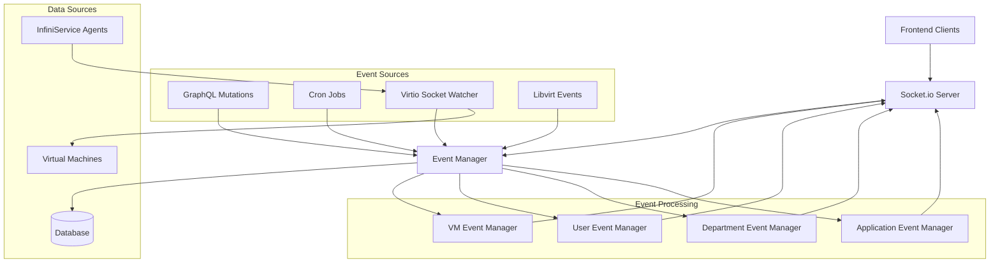
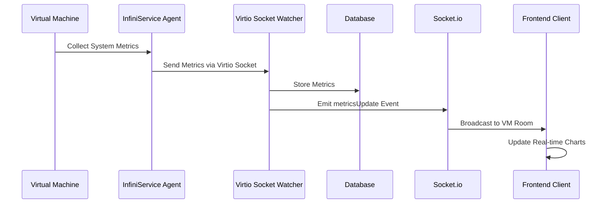

# Real-time Features Documentation

This document provides comprehensive documentation for Infinibay's real-time communication features, including WebSocket integration, event broadcasting, live metrics streaming, and virtio socket communication.

## Table of Contents

- [Real-time Architecture Overview](#real-time-architecture-overview)
- [WebSocket Communication](#websocket-communication)
- [Event Broadcasting System](#event-broadcasting-system)
- [Live Metrics & Monitoring](#live-metrics--monitoring)
- [Virtio Socket Integration](#virtio-socket-integration)
- [Client Integration](#client-integration)
- [Performance & Scalability](#performance--scalability)
- [Troubleshooting](#troubleshooting)

## Real-time Architecture Overview

Infinibay's real-time system is built on a multi-layered architecture that provides efficient, scalable communication between the backend and clients:



### Key Components

1. **Socket.io Server**: WebSocket communication layer with authentication
2. **Event Manager**: Central event coordination and dispatch
3. **Resource Event Managers**: Specialized handlers for different resource types
4. **Virtio Socket Watcher**: Direct VM communication for metrics collection
5. **Client Libraries**: Frontend integration for real-time updates

## WebSocket Communication

### Socket.io Integration

The `SocketService` class manages all WebSocket connections and provides real-time communication:

```typescript
export class SocketService {
  private io: SocketIOServer | null = null
  private connectedUsers: Map<string, AuthenticatedSocket> = new Map()

  initialize(httpServer: HTTPServer): void {
    this.io = new SocketIOServer(httpServer, {
      cors: {
        origin: process.env.FRONTEND_URL || 'http://localhost:3000',
        methods: ['GET', 'POST'],
        credentials: true
      },
      transports: ['websocket', 'polling']
    })

    this.setupAuthentication()
    this.setupConnectionHandlers()
  }
}
```

### Authentication & Authorization

WebSocket connections use JWT authentication with automatic user namespace assignment:

```typescript
// Authentication middleware
this.io?.use(async (socket: any, next) => {
  try {
    const token = socket.handshake.auth.token || socket.handshake.headers.authorization
    
    if (!token) {
      return next(new Error('Authentication token required'))
    }

    // Verify JWT token
    const decoded = jwt.verify(token, process.env.TOKENKEY || 'secret') as any
    
    // Fetch user from database
    const user = await this.prisma.user.findUnique({
      where: { id: decoded.userId }
    })

    if (!user) {
      return next(new Error('User not found'))
    }

    // Generate or retrieve user namespace
    let userNamespace = user.namespace
    if (!userNamespace) {
      userNamespace = this.generateUserNamespace(user.id)
      await this.prisma.user.update({
        where: { id: user.id },
        data: { namespace: userNamespace }
      })
    }

    // Attach user info to socket
    socket.userId = user.id
    socket.userRole = user.role
    socket.userNamespace = userNamespace
    socket.user = user

    next()
  } catch (error) {
    next(new Error('Authentication failed'))
  }
})
```

### Connection Management

```typescript
// Connection handling
this.io?.on('connection', (socket: any) => {
  const authSocket = socket as AuthenticatedSocket

  console.log(`🔌 User connected: ${authSocket.user.email} (${authSocket.id})`)

  // Store connected user
  this.connectedUsers.set(authSocket.userId, authSocket)

  // Join user to their personal namespace room
  socket.join(authSocket.userNamespace)

  // Join admin users to admin room
  if (authSocket.userRole === 'ADMIN') {
    socket.join('admin')
  }

  // Handle disconnection
  socket.on('disconnect', (reason: string) => {
    console.log(`🔌 User disconnected: ${authSocket.user.email} (${reason})`)
    this.connectedUsers.delete(authSocket.userId)
  })

  // Send welcome message
  socket.emit('connected', {
    message: 'Real-time connection established',
    namespace: authSocket.userNamespace,
    user: authSocket.user,
    timestamp: new Date().toISOString()
  })
})
```

### User Namespace System

Each user gets a unique, persistent namespace for targeted event delivery:

```typescript
// Generate unique namespace for user
private generateUserNamespace(userId: string): string {
  // Format: user_<userId_prefix>_<random>
  const randomSuffix = Math.random().toString(36).substring(2, 8)
  return `user_${userId.substring(0, 8)}_${randomSuffix}`
}

// Send event to specific user namespace
sendToUserNamespace(namespace: string, resource: string, action: string, payload: any): void {
  const eventName = `${namespace}:${resource}:${action}`

  this.io.to(namespace).emit(eventName, {
    status: payload.status || 'success',
    error: payload.error || null,
    data: payload.data || null,
    timestamp: new Date().toISOString()
  })
}
```

## Event Broadcasting System

### Event Manager Architecture

The `EventManager` coordinates all real-time events across the system:

```typescript
export class EventManager {
  private resourceManagers: Map<string, ResourceEventManager> = new Map()

  constructor(
    private socketService: SocketService,
    private prisma: PrismaClient
  ) {}

  // Register resource-specific managers
  registerResourceManager(resource: string, manager: ResourceEventManager): void {
    this.resourceManagers.set(resource, manager)
  }

  // Main event dispatch
  async dispatchEvent(
    resource: string,
    action: EventAction,
    data: any,
    triggeredBy?: string
  ): Promise<void> {
    const manager = this.resourceManagers.get(resource)
    if (!manager) {
      console.warn(`⚠️ No event manager found for resource: ${resource}`)
      return
    }

    await manager.handleEvent(action, data, triggeredBy)
  }
}
```

### Resource Event Managers

#### VM Event Manager

Handles all VM-related real-time events:

```typescript
export class VmEventManager implements ResourceEventManager {
  constructor(
    private socketService: SocketService,
    private prisma: PrismaClient
  ) {}

  async handleEvent(action: EventAction, data: any, triggeredBy?: string): Promise<void> {
    switch (action) {
      case 'create':
        await this.handleVmCreated(data, triggeredBy)
        break
      case 'update':
        await this.handleVmUpdated(data, triggeredBy)
        break
      case 'delete':
        await this.handleVmDeleted(data, triggeredBy)
        break
      case 'power_on':
      case 'power_off':
      case 'suspend':
        await this.handleVmStateChange(action, data, triggeredBy)
        break
    }
  }

  private async handleVmCreated(data: any, triggeredBy?: string): Promise<void> {
    // Fetch fresh VM data
    const vm = await this.prisma.machine.findUnique({
      where: { id: data.id },
      include: {
        user: true,
        department: true,
        template: true
      }
    })

    if (!vm) return

    // Broadcast to triggering user
    if (triggeredBy) {
      this.socketService.sendToUser(triggeredBy, 'vms', 'create', {
        status: 'success',
        data: vm
      })
    }

    // Broadcast to admins
    this.socketService.sendToAdmins('vms', 'create', {
      status: 'success',
      data: vm
    })

    // Broadcast to VM owner if different from trigger
    if (vm.userId && vm.userId !== triggeredBy) {
      this.socketService.sendToUser(vm.userId, 'vms', 'create', {
        status: 'success',
        data: vm
      })
    }
  }
}
```

#### User Event Manager

Manages user-related events:

```typescript
export class UserEventManager implements ResourceEventManager {
  async handleEvent(action: EventAction, data: any, triggeredBy?: string): Promise<void> {
    switch (action) {
      case 'create':
        await this.handleUserCreated(data, triggeredBy)
        break
      case 'update':
        await this.handleUserUpdated(data, triggeredBy)
        break
      case 'delete':
        await this.handleUserDeleted(data, triggeredBy)
        break
    }
  }

  private async handleUserCreated(data: any, triggeredBy?: string): Promise<void> {
    const user = await this.prisma.user.findUnique({
      where: { id: data.id },
      select: {
        id: true,
        email: true,
        firstName: true,
        lastName: true,
        role: true,
        createdAt: true
      }
    })

    if (!user) return

    // Broadcast to all admins
    this.socketService.sendToAdmins('users', 'create', {
      status: 'success',
      data: user
    })
  }
}
```

### Event Types & Actions

```typescript
export type EventAction = 'create' | 'update' | 'delete' | 'power_on' | 'power_off' | 'suspend' | 'resume'

export interface EventPayload {
  status: 'success' | 'error'
  error?: string
  data?: any
}
```

### Event Broadcasting Patterns

#### User-Specific Events
```typescript
// Send to specific user
this.socketService.sendToUser(userId, 'vms', 'power_on', {
  status: 'success',
  data: { vmId, status: 'running' }
})
```

#### Admin Broadcast
```typescript
// Send to all admin users
this.socketService.sendToAdmins('users', 'create', {
  status: 'success',
  data: newUser
})
```

#### Department-Specific Events
```typescript
// Send to users in specific department
const departmentUsers = await this.getDepartmentUsers(departmentId)
this.socketService.sendToUsers(departmentUsers, 'departments', 'update', {
  status: 'success',
  data: updatedDepartment
})
```

## Live Metrics & Monitoring

### Virtio Socket Watcher Service

The `VirtioSocketWatcherService` provides real-time metrics collection from VMs:

```typescript
export class VirtioSocketWatcherService extends EventEmitter {
  private server: net.Server | null = null
  private connections: Map<string, VirtioConnection> = new Map()
  private reconnectAttempts: Map<string, number> = new Map()

  async start(): Promise<void> {
    this.server = net.createServer(this.handleConnection.bind(this))
    
    this.server.listen(VIRTIO_SOCKET_PORT, () => {
      console.log(`🔌 Virtio Socket Watcher listening on port ${VIRTIO_SOCKET_PORT}`)
    })

    this.server.on('error', (error) => {
      console.error('🔌 Virtio Socket Server error:', error)
    })
  }

  private handleConnection(socket: net.Socket): void {
    console.log('🔌 New virtio socket connection from VM')

    let buffer = ''
    
    socket.on('data', (data) => {
      buffer += data.toString()
      
      // Process complete JSON messages
      const messages = buffer.split('\n')
      buffer = messages.pop() || ''
      
      for (const message of messages) {
        if (message.trim()) {
          this.processMessage(message, socket)
        }
      }
    })

    socket.on('close', () => {
      console.log('🔌 Virtio socket connection closed')
      this.handleDisconnection(socket)
    })

    socket.on('error', (error) => {
      console.error('🔌 Virtio socket error:', error)
    })
  }

  private async processMessage(message: string, socket: net.Socket): Promise<void> {
    try {
      const data = JSON.parse(message)
      
      switch (data.type) {
        case 'vm_identification':
          await this.handleVmIdentification(data, socket)
          break
        case 'system_metrics':
          await this.handleSystemMetrics(data)
          break
        case 'process_snapshot':
          await this.handleProcessSnapshot(data)
          break
        case 'application_usage':
          await this.handleApplicationUsage(data)
          break
        case 'port_usage':
          await this.handlePortUsage(data)
          break
      }
    } catch (error) {
      console.error('🔌 Error processing virtio message:', error)
    }
  }
}
```

### Real-time Metrics Broadcasting

```typescript
// Forward metrics to WebSocket clients
virtioSocketWatcher.on('metricsUpdated', ({ vmId, metrics }) => {
  socketService.emitToRoom(`vm:${vmId}`, 'metricsUpdate', { vmId, metrics })
})

// System metrics handling
private async handleSystemMetrics(data: any): Promise<void> {
  const vmId = data.vmId
  const metrics = data.metrics

  // Store in database
  await this.prisma.systemMetrics.create({
    data: {
      machineId: vmId,
      cpuUsagePercent: metrics.cpu.usage_percent,
      cpuCoresUsage: metrics.cpu.cores_usage,
      totalMemoryKB: BigInt(metrics.memory.total_kb),
      usedMemoryKB: BigInt(metrics.memory.used_kb),
      availableMemoryKB: BigInt(metrics.memory.available_kb),
      diskUsageStats: metrics.disk.usage_stats,
      diskIOStats: metrics.disk.io_stats,
      networkStats: metrics.network.stats,
      uptime: BigInt(metrics.system.uptime),
      loadAverage: metrics.system.load_average
    }
  })

  // Emit real-time update
  this.emit('metricsUpdated', { vmId, metrics })
}
```

### Metrics Data Flow



## Virtio Socket Integration

### VM Communication Protocol

InfiniService agents running inside VMs communicate with the host through virtio sockets:

```json
// VM Identification Message
{
  "type": "vm_identification",
  "vmId": "uuid-string",
  "hostname": "vm-hostname",
  "os": "windows",
  "version": "Windows 10",
  "agent_version": "1.0.0"
}

// System Metrics Message
{
  "type": "system_metrics",
  "vmId": "uuid-string",
  "timestamp": "2023-01-01T00:00:00Z",
  "metrics": {
    "cpu": {
      "usage_percent": 45.2,
      "cores_usage": [30.1, 25.5, 60.8, 40.2],
      "temperature": 65.5
    },
    "memory": {
      "total_kb": 8388608,
      "used_kb": 4194304,
      "available_kb": 4194304,
      "swap_total_kb": 2097152,
      "swap_used_kb": 0
    },
    "disk": {
      "usage_stats": [
        {
          "mount_point": "C:",
          "total_gb": 100,
          "used_gb": 45,
          "available_gb": 55
        }
      ],
      "io_stats": {
        "read_bytes_per_sec": 1048576,
        "write_bytes_per_sec": 524288
      }
    },
    "network": {
      "stats": [
        {
          "interface": "Ethernet",
          "bytes_received": 1048576,
          "bytes_sent": 524288,
          "packets_received": 1000,
          "packets_sent": 500
        }
      ]
    },
    "system": {
      "uptime": 86400,
      "load_average": {
        "load1min": 0.5,
        "load5min": 0.3,
        "load15min": 0.2
      }
    }
  }
}
```

### Connection Management

```typescript
interface VirtioConnection {
  vmId: string
  socket: net.Socket
  lastHeartbeat: Date
  isAuthenticated: boolean
  metadata: {
    hostname: string
    os: string
    version: string
    agentVersion: string
  }
}

private connections: Map<string, VirtioConnection> = new Map()

private async handleVmIdentification(data: any, socket: net.Socket): Promise<void> {
  const connection: VirtioConnection = {
    vmId: data.vmId,
    socket,
    lastHeartbeat: new Date(),
    isAuthenticated: true,
    metadata: {
      hostname: data.hostname,
      os: data.os,
      version: data.version,
      agentVersion: data.agent_version
    }
  }

  this.connections.set(data.vmId, connection)
  
  // Update VM status in database
  await this.prisma.machine.update({
    where: { id: data.vmId },
    data: { status: 'running' }
  })

  console.log(`✅ VM ${data.vmId} identified and connected`)
}
```

## Client Integration

### Frontend WebSocket Setup

```typescript
import io from 'socket.io-client'

class SocketService {
  private socket: Socket | null = null

  connect(token: string): void {
    this.socket = io(process.env.NEXT_PUBLIC_BACKEND_HOST, {
      auth: { token },
      transports: ['websocket', 'polling']
    })

    this.socket.on('connect', () => {
      console.log('✅ Connected to real-time server')
    })

    this.socket.on('connected', (data) => {
      console.log('🎉 Welcome message:', data)
      this.userNamespace = data.namespace
    })

    this.setupEventListeners()
  }

  private setupEventListeners(): void {
    // Listen for VM events
    this.socket?.on(/.*:vms:.*/, (payload) => {
      this.handleVmEvent(payload)
    })

    // Listen for user events
    this.socket?.on(/.*:users:.*/, (payload) => {
      this.handleUserEvent(payload)
    })

    // Listen for metrics updates
    this.socket?.on('metricsUpdate', (payload) => {
      this.handleMetricsUpdate(payload)
    })
  }
}
```

### Redux Integration

```typescript
// Real-time Redux middleware
export const realTimeMiddleware: Middleware = (store) => (next) => (action) => {
  const result = next(action)

  // Handle real-time events
  if (action.type.startsWith('realtime/')) {
    const { resource, eventAction, data } = action.payload

    switch (resource) {
      case 'vms':
        store.dispatch(updateVmInState(data))
        break
      case 'users':
        store.dispatch(updateUserInState(data))
        break
      case 'departments':
        store.dispatch(updateDepartmentInState(data))
        break
    }
  }

  return result
}

// Real-time event handlers
export const realTimeService = {
  handleVmEvent: (payload: any) => {
    store.dispatch({
      type: 'realtime/vm_event',
      payload: {
        resource: 'vms',
        eventAction: payload.action,
        data: payload.data
      }
    })
  },

  handleMetricsUpdate: (payload: any) => {
    store.dispatch({
      type: 'metrics/update',
      payload: {
        vmId: payload.vmId,
        metrics: payload.metrics
      }
    })
  }
}
```

## Performance & Scalability

### Connection Pooling

```typescript
export class SocketConnectionManager {
  private maxConnections = 1000
  private connectionCount = 0

  onConnection(socket: Socket): void {
    if (this.connectionCount >= this.maxConnections) {
      socket.disconnect(true)
      return
    }

    this.connectionCount++
    
    socket.on('disconnect', () => {
      this.connectionCount--
    })
  }
}
```

### Memory Management

```typescript
export class MetricsBufferManager {
  private buffers: Map<string, CircularBuffer> = new Map()
  private readonly BUFFER_SIZE = 1000

  addMetrics(vmId: string, metrics: any): void {
    if (!this.buffers.has(vmId)) {
      this.buffers.set(vmId, new CircularBuffer(this.BUFFER_SIZE))
    }

    const buffer = this.buffers.get(vmId)!
    buffer.add(metrics)

    // Broadcast only latest metrics
    this.broadcastLatestMetrics(vmId, metrics)
  }

  getRecentMetrics(vmId: string, count: number = 100): any[] {
    const buffer = this.buffers.get(vmId)
    return buffer ? buffer.getRecent(count) : []
  }
}
```

### Rate Limiting

```typescript
export class EventRateLimiter {
  private limits: Map<string, RateLimit> = new Map()

  canEmit(userId: string, eventType: string): boolean {
    const key = `${userId}:${eventType}`
    const limit = this.limits.get(key) || { count: 0, lastReset: Date.now() }

    // Reset counter every minute
    if (Date.now() - limit.lastReset > 60000) {
      limit.count = 0
      limit.lastReset = Date.now()
    }

    // Allow up to 100 events per minute per user per event type
    if (limit.count >= 100) {
      return false
    }

    limit.count++
    this.limits.set(key, limit)
    return true
  }
}
```

## Troubleshooting

### Connection Issues

```typescript
// Debug connection problems
export class SocketDebugger {
  logConnectionState(socket: Socket): void {
    console.log('Socket State:', {
      id: socket.id,
      connected: socket.connected,
      disconnected: socket.disconnected,
      rooms: Array.from(socket.rooms),
      transport: socket.conn?.transport?.name
    })
  }

  diagnoseConnectionFailure(error: any): string {
    if (error.message.includes('Authentication')) {
      return 'Check JWT token validity and format'
    } else if (error.message.includes('CORS')) {
      return 'Verify CORS configuration and allowed origins'
    } else if (error.message.includes('timeout')) {
      return 'Network connectivity issues or server overload'
    }
    return 'Unknown connection error'
  }
}
```

### Event Delivery Debugging

```typescript
export class EventDeliveryTracker {
  private deliveryLog: Map<string, EventLog[]> = new Map()

  trackEvent(userId: string, eventType: string, success: boolean): void {
    const log = this.deliveryLog.get(userId) || []
    log.push({
      eventType,
      timestamp: new Date(),
      success,
      id: this.generateEventId()
    })

    // Keep only last 100 events per user
    if (log.length > 100) {
      log.shift()
    }

    this.deliveryLog.set(userId, log)
  }

  getDeliveryStats(userId: string): EventDeliveryStats {
    const log = this.deliveryLog.get(userId) || []
    const total = log.length
    const successful = log.filter(e => e.success).length

    return {
      total,
      successful,
      failed: total - successful,
      successRate: total > 0 ? (successful / total) * 100 : 0
    }
  }
}
```

This real-time system provides Infinibay with robust, scalable communication capabilities that enable rich, interactive user experiences while maintaining performance and reliability.