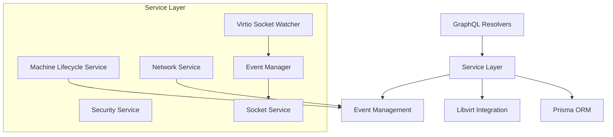

# Service Layer Documentation

This document provides comprehensive documentation for Infinibay's service layer architecture, including business logic implementation, event management, and real-time communication services.

## Table of Contents

- [Service Architecture Overview](#service-architecture-overview)
- [Core Services](#core-services)
- [Event Management System](#event-management-system)
- [Real-time Communication](#real-time-communication)
- [VM Lifecycle Management](#vm-lifecycle-management)
- [Security Services](#security-services)
- [Monitoring & Metrics](#monitoring--metrics)
- [Service Patterns](#service-patterns)

## Service Architecture Overview

The service layer in Infinibay follows a clean architecture pattern with clear separation of concerns:



### Design Principles

1. **Single Responsibility**: Each service handles one domain of business logic
2. **Dependency Injection**: Services receive dependencies through constructors
3. **Event-Driven**: Services communicate through events for loose coupling
4. **Type Safety**: Full TypeScript implementation with strong typing
5. **Testability**: Services are easily mockable and testable

## Core Services

### 1. Machine Lifecycle Service

The `MachineLifecycleService` handles all VM lifecycle operations through a sophisticated orchestration system that coordinates virtualization resources, database state, and user permissions.

```typescript
export class MachineLifecycleService {
  constructor(
    private prisma: PrismaClient,
    private user: User | null
  ) {}

  async createMachine(input: CreateMachineInputType): Promise<Machine>
  async updateMachineHardware(input: UpdateMachineHardwareInput): Promise<Machine>
  async destroyMachine(id: string): Promise<SuccessType>
  async cloneMachine(sourceId: string, targetName: string): Promise<Machine>
}
```

**What it does**: Orchestrates the complete VM lifecycle from initial creation through final destruction, managing all associated resources including storage, networking, security policies, and database records.

**Why this design**:
- **Atomic Operations**: Ensures either complete success or complete rollback for complex VM operations
- **User Context**: Maintains user context throughout operations for security and audit purposes
- **Resource Coordination**: Coordinates multiple subsystems (libvirt, storage, networking, security)
- **State Consistency**: Keeps database state synchronized with actual hypervisor state

**What for**:
- **Reliability**: Users can trust that VM operations either complete successfully or leave no orphaned resources
- **Security**: All operations respect user permissions and department boundaries
- **Audit Compliance**: Complete tracking of who performed what operations when
- **Developer Experience**: Simple API abstracts complex virtualization operations

**Key Responsibilities:**
- **VM Creation**: Template processing, resource allocation, security policy application
- **Hardware Updates**: Dynamic reconfiguration of CPU, memory, and storage
- **VM Destruction**: Complete cleanup of all associated resources
- **State Management**: Validation and error handling with comprehensive rollback

**Example Usage:**
```typescript
const lifecycleService = new MachineLifecycleService(prisma, user);

// Create a new VM with automatic security policy application
const newMachine = await lifecycleService.createMachine({
  name: 'Development Server',
  templateId: 'template-uuid',
  username: 'admin',
  password: 'secure-password',
  os: MachineOs.UBUNTU,
  departmentId: 'engineering-dept'  // Automatically applies department security policies
});

// Update hardware with live reconfiguration
const updatedMachine = await lifecycleService.updateMachineHardware({
  id: newMachine.id,
  cpu: 4,
  memory: 8192,
  storage: 100
});
```

**Performance Considerations**:
- **Transaction Management**: Uses database transactions to ensure consistency
- **Resource Pooling**: Reuses connections to hypervisor and database
- **Event Integration**: Broadcasts real-time updates to connected users
- **Error Recovery**: Comprehensive rollback mechanisms prevent resource leaks

### 2. Network Service

The NetworkService provides comprehensive virtual network management that bridges the gap between enterprise network requirements and hypervisor capabilities, enabling secure, scalable VM networking.

```typescript
export class NetworkService {
  async createNetwork(input: CreateNetworkInput): Promise<boolean>
  async deleteNetwork(input: DeleteNetworkInput): Promise<boolean>
  async updateNetworkConfiguration(config: NetworkConfig): Promise<boolean>
  async listAvailableNetworks(): Promise<Network[]>
}
```

**What it does**: Manages the complete virtual networking stack including network creation, IP address management, bridge configuration, and integration with the underlying Linux network infrastructure.

**Why this approach**:
- **Network Abstraction**: Abstracts complex libvirt network configuration into simple, business-oriented operations
- **Enterprise Integration**: Seamlessly integrates with existing enterprise network infrastructure
- **Security by Default**: All networks are created with appropriate security policies and isolation
- **Dynamic Configuration**: Networks can be modified without affecting running VMs

**What for**:
- **Scalability**: Supports hundreds of VMs across multiple network segments
- **Security**: Provides network-level isolation between departments and projects
- **Flexibility**: Accommodates various network topologies and enterprise requirements
- **Automation**: Enables automated network provisioning as part of VM deployment

**Key Features:**
- **Virtual Network Creation**: Creates isolated network segments with custom IP ranges
- **Bridge Management**: Configures and manages network bridges for VM connectivity
- **DHCP Integration**: Automatic IP address assignment with configurable ranges
- **Network Isolation**: Department-based network segmentation with security policies
- **Traffic Shaping**: Bandwidth management and QoS configuration
- **Enterprise Integration**: VLAN tagging and enterprise network integration

**Example Usage:**
```typescript
const networkService = new NetworkService(prisma, libvirtConnection);

// Create a department-specific network
const network = await networkService.createNetwork({
  name: 'engineering-network',
  cidr: '192.168.100.0/24',
  dhcpStart: '192.168.100.10',
  dhcpEnd: '192.168.100.200',
  gateway: '192.168.100.1',
  departmentId: 'engineering-dept',
  vlanId: 100,
  isolated: true  // Prevents cross-department communication
});

// Update network configuration
await networkService.updateNetworkConfiguration({
  networkId: network.id,
  bandwidth: {
    inbound: '1000Mbps',
    outbound: '1000Mbps'
  },
  securityPolicies: ['deny-inter-department', 'allow-internet']
});
```

**Network Architecture Integration**:
- **Bridge Mode**: Connects VMs to physical network infrastructure
- **NAT Mode**: Provides internet access while maintaining isolation
- **Isolated Mode**: Complete network isolation for sensitive workloads
- **Routed Mode**: Integration with enterprise routing infrastructure

### 3. Security Service

Handles network filtering and firewall management:

```typescript
export class NetworkFilterService {
  async createFilter(input: CreateFilterInput): Promise<NWFilter>
  async addRule(filterId: string, rule: FWRule): Promise<FWRule>
  async applyFilterToVM(vmId: string, filterId: string): Promise<boolean>
  async flushFilters(): Promise<boolean>
}
```

**Security Features:**
- Network filter creation and management
- Firewall rule configuration
- Department-based security policies
- Service access control

### 4. Firewall Service

Specialized service for firewall rule management:

```typescript
export class FirewallService {
  async createRule(input: CreateFilterRuleInput): Promise<FWRule>
  async updateRule(id: string, input: UpdateFilterRuleInput): Promise<FWRule>
  async deleteRule(id: string): Promise<boolean>
  async validateRule(rule: FWRule): Promise<boolean>
}
```

## Event Management System

### Event Manager

The central event coordination service:

```typescript
export class EventManager {
  private resourceManagers: Map<string, ResourceEventManager> = new Map()
  
  constructor(
    private socketService: SocketService,
    private prisma: PrismaClient
  ) {}

  registerResourceManager(resource: string, manager: ResourceEventManager): void
  async dispatchEvent(resource: string, action: EventAction, data: any, triggeredBy?: string): Promise<void>
}
```

### Event Actions
```typescript
export type EventAction = 'create' | 'update' | 'delete' | 'power_on' | 'power_off' | 'suspend' | 'resume'
```

### Resource Event Managers

#### VM Event Manager
```typescript
export class VmEventManager implements ResourceEventManager {
  async handleEvent(action: EventAction, data: any, triggeredBy?: string): Promise<void> {
    switch (action) {
      case 'create':
        await this.handleVmCreated(data, triggeredBy);
        break;
      case 'power_on':
        await this.handleVmPowerOn(data, triggeredBy);
        break;
      // ... other actions
    }
  }
}
```

#### User Event Manager
```typescript
export class UserEventManager implements ResourceEventManager {
  async handleEvent(action: EventAction, data: any, triggeredBy?: string): Promise<void> {
    // Handle user-related events
    // Broadcast to admin users
    // Update user sessions
  }
}
```

#### Department Event Manager
```typescript
export class DepartmentEventManager implements ResourceEventManager {
  async handleEvent(action: EventAction, data: any, triggeredBy?: string): Promise<void> {
    // Handle department changes
    // Update related VMs
    // Broadcast to affected users
  }
}
```

## Real-time Communication

### Socket Service

Manages WebSocket connections and real-time communication:

```typescript
export class SocketService {
  private io: SocketIOServer | null = null
  private connectedUsers: Map<string, AuthenticatedSocket> = new Map()

  initialize(httpServer: HTTPServer): void
  sendToUser(userId: string, resource: string, action: string, payload: any): void
  sendToAdmins(resource: string, action: string, payload: any): void
  emitToRoom(room: string, eventName: string, payload: any): void
}
```

**Features:**
- JWT-based WebSocket authentication
- User namespace management
- Admin broadcast channels
- Connection state tracking

### Authenticated Socket Interface
```typescript
export interface AuthenticatedSocket {
  id: string
  userId: string
  userRole: string
  userNamespace: string
  user: {
    id: string
    email: string
    firstName: string
    lastName: string
    role: string
  }
}
```

### Event Broadcasting Pattern
```typescript
// Service triggers event
const eventManager = getEventManager();
await eventManager.dispatchEvent('vms', 'create', { id: newVmId }, userId);

// Event Manager processes and broadcasts
// → VM Event Manager handles VM-specific logic
// → Socket Service broadcasts to relevant users
// → Frontend receives real-time update
```

## VM Lifecycle Management

### Creation Workflow

1. **Input Validation**: Validate create machine input
2. **Template Processing**: Load and process machine template
3. **Resource Allocation**: Allocate CPU, RAM, and storage
4. **XML Generation**: Generate libvirt domain XML
5. **Domain Creation**: Create domain in libvirt
6. **Database Record**: Store machine record in database
7. **Event Broadcasting**: Broadcast creation event

```typescript
async createMachine(input: CreateMachineInputType): Promise<Machine> {
  // 1. Validate input
  await this.validateCreateInput(input);
  
  // 2. Load template
  const template = await this.prisma.machineTemplate.findUnique({
    where: { id: input.templateId }
  });
  
  // 3. Generate internal name
  const internalName = this.generateInternalName(input.name);
  
  // 4. Create database record
  const machine = await this.prisma.machine.create({
    data: {
      name: input.name,
      internalName,
      templateId: input.templateId,
      userId: this.user?.id,
      departmentId: input.departmentId,
      os: input.os,
      status: 'creating'
    }
  });
  
  // 5. Create VM in libvirt
  const virtManager = new VirtManager();
  await virtManager.createMachine(machine, input.username, input.password, input.productKey, input.pciBus);
  
  // 6. Update status
  await this.prisma.machine.update({
    where: { id: machine.id },
    data: { status: 'off' }
  });
  
  return machine;
}
```

### Destruction Workflow

1. **Permission Check**: Verify user can delete VM
2. **State Validation**: Ensure VM can be safely deleted
3. **Libvirt Cleanup**: Remove domain from libvirt
4. **Storage Cleanup**: Remove associated storage volumes
5. **Database Cleanup**: Remove database records
6. **Event Broadcasting**: Broadcast deletion event

### Hardware Update Workflow

1. **Validation**: Check hardware constraints
2. **State Check**: Ensure VM is in valid state for updates
3. **Configuration Update**: Update libvirt domain configuration
4. **Database Update**: Update hardware specifications
5. **Event Broadcasting**: Broadcast update event

## Security Services

### Network Filter Management

```typescript
export class NetworkFilterService {
  async createDepartmentFilter(departmentId: string, rules: FWRule[]): Promise<NWFilter> {
    // Create department-specific network filter
    const filter = await this.prisma.nWFilter.create({
      data: {
        name: `dept-${departmentId}-filter`,
        internalName: `infinibay-dept-${departmentId}`,
        type: 'department',
        description: `Security filter for department ${departmentId}`
      }
    });
    
    // Add rules to filter
    for (const rule of rules) {
      await this.addRule(filter.id, rule);
    }
    
    // Apply to libvirt
    await this.flushFilter(filter.id);
    
    return filter;
  }
}
```

### Service Access Control

```typescript
export class ServiceConfigService {
  async toggleVmService(input: ToggleVmServiceInput): Promise<VmServiceStatus> {
    // Update VM service configuration
    const config = await this.prisma.vMServiceConfig.upsert({
      where: {
        vmId_serviceId: {
          vmId: input.vmId,
          serviceId: input.serviceId
        }
      },
      update: {
        [input.action === 'USE' ? 'useEnabled' : 'provideEnabled']: input.enabled
      },
      create: {
        vmId: input.vmId,
        serviceId: input.serviceId,
        useEnabled: input.action === 'USE' ? input.enabled : false,
        provideEnabled: input.action === 'PROVIDE' ? input.enabled : false
      }
    });
    
    // Update firewall rules
    await this.updateFirewallRulesForService(input.vmId, input.serviceId);
    
    return this.getVmServiceStatus(input.vmId, input.serviceId);
  }
}
```

## Monitoring & Metrics

### Virtio Socket Watcher Service

Collects real-time metrics from VMs:

```typescript
export class VirtioSocketWatcherService extends EventEmitter {
  private connections: Map<string, VirtioConnection> = new Map()
  
  async start(): Promise<void> {
    // Start listening for VM connections
    this.server = net.createServer(this.handleConnection.bind(this));
    this.server.listen(VIRTIO_SOCKET_PORT);
  }
  
  private handleConnection(socket: net.Socket): void {
    // Handle incoming VM metrics data
    socket.on('data', (data) => {
      const metrics = this.parseMetricsData(data);
      this.processMetrics(metrics);
    });
  }
  
  private async processMetrics(metrics: VmMetrics): Promise<void> {
    // Store metrics in database
    await this.storeMetrics(metrics);
    
    // Emit real-time update
    this.emit('metricsUpdated', {
      vmId: metrics.vmId,
      metrics: metrics.data
    });
  }
}
```

### QEMU Guest Agent Service

Manages guest agent communication:

```typescript
export class QemuGuestAgentService {
  async executeCommand(vmId: string, command: string): Promise<string> {
    // Execute command via QEMU guest agent
    const connection = Connection.open('qemu:///system');
    const domain = VirtualMachine.lookupByName(connection, vmId);
    
    const result = await domain.qemuAgentCommand(JSON.stringify({
      execute: command
    }), 0, 0);
    
    connection.close();
    return result;
  }
  
  async getGuestInfo(vmId: string): Promise<GuestInfo> {
    // Get comprehensive guest information
    const info = await this.executeCommand(vmId, 'guest-get-osinfo');
    return JSON.parse(info);
  }
}
```

## Service Patterns

### Dependency Injection Pattern

```typescript
// Service receives dependencies in constructor
export class MachineLifecycleService {
  constructor(
    private prisma: PrismaClient,
    private user: User | null,
    private eventManager?: EventManager,
    private virtManager?: VirtManager
  ) {
    this.eventManager = eventManager || getEventManager();
    this.virtManager = virtManager || new VirtManager();
  }
}
```

### Event Publishing Pattern

```typescript
// Services publish events for loose coupling
export class MachineLifecycleService {
  async createMachine(input: CreateMachineInputType): Promise<Machine> {
    const machine = await this.performCreate(input);
    
    // Publish event
    if (this.eventManager) {
      await this.eventManager.dispatchEvent('vms', 'create', machine, this.user?.id);
    }
    
    return machine;
  }
}
```

### Error Handling Pattern

```typescript
export class MachineLifecycleService {
  async destroyMachine(id: string): Promise<SuccessType> {
    try {
      await this.performDestroy(id);
      return { success: true, message: 'Machine destroyed successfully' };
    } catch (error) {
      console.error('Failed to destroy machine:', error);
      return { 
        success: false, 
        message: error instanceof Error ? error.message : 'Unknown error occurred'
      };
    }
  }
}
```

### Validation Pattern

```typescript
export class MachineLifecycleService {
  private async validateCreateInput(input: CreateMachineInputType): Promise<void> {
    // Validate template exists
    const template = await this.prisma.machineTemplate.findUnique({
      where: { id: input.templateId }
    });
    if (!template) {
      throw new UserInputError('Template not found');
    }
    
    // Validate department access
    if (input.departmentId && !await this.canAccessDepartment(input.departmentId)) {
      throw new ForbiddenError('Insufficient department access');
    }
    
    // Additional validations...
  }
}
```

The service layer provides a robust foundation for Infinibay's business logic while maintaining clean architecture principles and enabling comprehensive testing and maintainability.