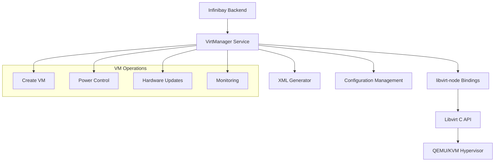

# Virtualization Integration Documentation

This document provides comprehensive documentation for Infinibay's virtualization integration, covering libvirt bindings, VM management, network configuration, and storage handling.

## Table of Contents

- [Libvirt Integration Overview](#libvirt-integration-overview)
- [Custom Rust Bindings](#custom-rust-bindings)
- [VM Management](#vm-management)
- [Network Management](#network-management)
- [Storage Management](#storage-management)
- [Security & Filtering](#security--filtering)
- [XML Generation](#xml-generation)
- [Performance Considerations](#performance-considerations)

## Libvirt Integration Overview

Infinibay uses libvirt as the primary virtualization management layer, providing a unified interface to KVM/QEMU hypervisors. The integration is built on custom Rust bindings that offer superior performance and type safety.

### Architecture



### Key Components

1. **VirtManager**: High-level virtualization management service
2. **libvirt-node**: Custom Rust bindings for libvirt
3. **XML Generators**: Domain and network XML configuration
4. **CreateMachineService**: Specialized VM creation workflow
5. **GraphicPortService**: VNC/SPICE port management

## Custom Rust Bindings

### libvirt-node Package

The custom `libvirt-node` package provides type-safe, performant bindings to libvirt:

```typescript
// Connection management
export class Connection {
  static open(uri: string): Connection
  close(): void
  isAlive(): boolean
  getType(): string
  getVersion(): number
}

// Domain (VM) management
export class Machine {
  static lookupByName(conn: Connection, name: string): Machine
  create(): boolean
  destroy(): boolean
  shutdown(): boolean
  suspend(): boolean
  resume(): boolean
  getState(): [number, number]
  getInfo(): DomainInfo
}

// Network management
export class Network {
  static lookupByName(conn: Connection, name: string): Network
  create(): boolean
  destroy(): boolean
  getXMLDesc(): string
}

// Storage management
export class StoragePool {
  static lookupByName(conn: Connection, name: string): StoragePool
  createVolume(xml: string): StorageVol
  listVolumes(): string[]
}
```

### Rust Implementation Highlights

Located in `/lib/libvirt-node/src/`:

- **connection.rs**: Connection management and hypervisor interaction
- **machine.rs**: Domain lifecycle and state management
- **network.rs**: Virtual network operations
- **storage_pool.rs**: Storage pool and volume management
- **nw_filter.rs**: Network filtering and security

### Type Safety Benefits

```typescript
// Strong typing prevents runtime errors
interface DomainInfo {
  state: number;
  maxMem: number;
  memory: number;
  nrVirtCpu: number;
  cpuTime: number;
}

// Enum-based state management
enum DomainState {
  VIR_DOMAIN_NOSTATE = 0,
  VIR_DOMAIN_RUNNING = 1,
  VIR_DOMAIN_BLOCKED = 2,
  VIR_DOMAIN_PAUSED = 3,
  VIR_DOMAIN_SHUTDOWN = 4,
  VIR_DOMAIN_SHUTOFF = 5,
  VIR_DOMAIN_CRASHED = 6,
  VIR_DOMAIN_PMSUSPENDED = 7
}
```

## VM Management

### VirtManager Service

The main virtualization management service:

```typescript
export class VirtManager {
  private libvirt: Connection | null = null
  private uri: string = 'qemu:///system'
  
  constructor(uri: string = 'qemu:///system') {
    this.uri = uri
    this.connect()
  }
  
  connect(uri?: string): void {
    if (uri) this.uri = uri
    this.libvirt = Connection.open(this.uri)
  }
  
  async createMachine(machine: Machine, username: string, password: string, productKey?: string, pciBus?: string): Promise<void>
  async powerOn(domainName: string): Promise<void>
  async powerOff(domainName: string): Promise<void>
  async suspend(domainName: string): Promise<void>
}
```

### VM Creation Workflow

The `CreateMachineService` handles the complex VM creation process:

```typescript
export class CreateMachineService {
  async create(machine: Machine, username: string, password: string, productKey?: string, pciBus?: string): Promise<void> {
    // 1. Validate input parameters
    await this.validateInput(machine, username, password)
    
    // 2. Load machine template
    const template = await this.loadTemplate(machine.templateId)
    
    // 3. Process applications
    const applications = await this.processApplications(machine.id)
    
    // 4. Determine OS-specific configuration
    const unattendedManager = this.getUnattendedManager(machine.os)
    
    // 5. Generate unattended installation ISO
    const isoPath = await unattendedManager.generateISO(machine, username, password, applications, productKey)
    
    // 6. Generate domain XML
    const xml = await this.generateDomainXML(machine, template, isoPath, pciBus)
    
    // 7. Create domain in libvirt
    await this.createLibvirtDomain(xml)
    
    // 8. Configure networking
    await this.configureNetworking(machine)
    
    // 9. Set up monitoring
    await this.setupMonitoring(machine)
  }
}
```

### Power Management

```typescript
export class VirtManager {
  async powerOn(domainName: string): Promise<void> {
    if (!this.libvirt) throw new Error('Libvirt connection not established')
    
    const domain = VirtualMachine.lookupByName(this.libvirt, domainName)
    if (!domain) throw new Error(`Domain ${domainName} not found`)
    
    domain.create() // Start the domain
  }
  
  async powerOff(domainName: string): Promise<void> {
    const domain = VirtualMachine.lookupByName(this.libvirt, domainName)
    
    try {
      // Try graceful shutdown first
      domain.shutdown()
      await this.waitForStateChange(domain, 'shutoff', 30000)
    } catch (error) {
      // Force destroy if graceful shutdown fails
      console.warn('Graceful shutdown failed, forcing destroy')
      domain.destroy()
    }
  }
}
```

### Hardware Updates

```typescript
export class HardwareUpdateService {
  async updateCPU(vmId: string, cores: number): Promise<void> {
    const domain = this.getDomain(vmId)
    
    // Update domain configuration
    const xml = await domain.getXMLDesc()
    const updatedXML = this.updateCPUInXML(xml, cores)
    
    // Apply configuration
    await this.applyConfiguration(domain, updatedXML)
  }
  
  async updateMemory(vmId: string, memoryGB: number): Promise<void> {
    const domain = this.getDomain(vmId)
    const memoryKB = memoryGB * 1024 * 1024
    
    // Update memory allocation
    domain.setMemory(memoryKB)
  }
  
  async attachGPU(vmId: string, pciAddress: string): Promise<void> {
    const domain = this.getDomain(vmId)
    
    // Generate GPU device XML
    const deviceXML = this.generateGPUDeviceXML(pciAddress)
    
    // Attach device to domain
    domain.attachDevice(deviceXML)
  }
}
```

## Network Management

### Virtual Network Configuration

```typescript
export class NetworkService {
  async createNetwork(input: CreateNetworkInput): Promise<boolean> {
    const xml = this.generateNetworkXML(input)
    
    const connection = Connection.open('qemu:///system')
    const network = connection.defineNetworkXML(xml)
    
    if (input.autostart) {
      network.setAutostart(true)
    }
    
    network.create()
    connection.close()
    
    return true
  }
  
  private generateNetworkXML(input: CreateNetworkInput): string {
    return `
      <network>
        <name>${input.name}</name>
        <description>${input.description}</description>
        <bridge name="${input.bridgeName}" stp="on" delay="0"/>
        <ip address="${input.ipConfig.address}" netmask="${input.ipConfig.netmask}">
          ${input.ipConfig.dhcp ? `
            <dhcp>
              <range start="${input.ipConfig.dhcp.start}" end="${input.ipConfig.dhcp.end}"/>
            </dhcp>
          ` : ''}
        </ip>
      </network>
    `
  }
}
```

### Bridge Management

```typescript
export class BridgeService {
  async createBridge(name: string, ipAddress: string): Promise<void> {
    // Create bridge interface
    await this.executeCommand(`ip link add name ${name} type bridge`)
    await this.executeCommand(`ip addr add ${ipAddress} dev ${name}`)
    await this.executeCommand(`ip link set dev ${name} up`)
  }
  
  async attachInterface(bridgeName: string, interfaceName: string): Promise<void> {
    await this.executeCommand(`ip link set dev ${interfaceName} master ${bridgeName}`)
  }
}
```

## Storage Management

### Storage Pool Operations

```typescript
export class StorageService {
  async createStoragePool(name: string, path: string): Promise<void> {
    const xml = `
      <pool type="dir">
        <name>${name}</name>
        <target>
          <path>${path}</path>
        </target>
      </pool>
    `
    
    const connection = Connection.open('qemu:///system')
    const pool = connection.defineStoragePoolXML(xml)
    pool.build(0)
    pool.create()
    pool.setAutostart(true)
    connection.close()
  }
  
  async createVolume(poolName: string, volumeName: string, sizeGB: number, format: string = 'qcow2'): Promise<string> {
    const xml = `
      <volume>
        <name>${volumeName}</name>
        <capacity unit="G">${sizeGB}</capacity>
        <target>
          <format type="${format}"/>
        </target>
      </volume>
    `
    
    const connection = Connection.open('qemu:///system')
    const pool = StoragePool.lookupByName(connection, poolName)
    const volume = pool.createVolume(xml)
    const path = volume.getPath()
    connection.close()
    
    return path
  }
}
```

### Volume Management

```typescript
export class VolumeService {
  async resizeVolume(volumePath: string, newSizeGB: number): Promise<void> {
    const connection = Connection.open('qemu:///system')
    const volume = this.lookupVolumeByPath(connection, volumePath)
    
    const newSizeBytes = newSizeGB * 1024 * 1024 * 1024
    volume.resize(newSizeBytes)
    
    connection.close()
  }
  
  async cloneVolume(sourceVolume: string, targetName: string): Promise<string> {
    const xml = this.generateCloneVolumeXML(targetName)
    
    const connection = Connection.open('qemu:///system')
    const pool = this.getStoragePool(connection)
    const newVolume = pool.createVolume(xml)
    
    // Copy data from source
    await this.copyVolumeData(sourceVolume, newVolume.getPath())
    
    connection.close()
    return newVolume.getPath()
  }
}
```

## Security & Filtering

### Network Filter Management

```typescript
export class NetworkFilterService {
  async createFilter(name: string, rules: FWRule[]): Promise<void> {
    const xml = this.generateFilterXML(name, rules)
    
    const connection = Connection.open('qemu:///system')
    connection.defineNWFilterXML(xml)
    connection.close()
  }
  
  private generateFilterXML(name: string, rules: FWRule[]): string {
    const rulesXML = rules.map(rule => this.generateRuleXML(rule)).join('\n')
    
    return `
      <filter name="${name}" chain="root">
        <uuid>${this.generateUUID()}</uuid>
        ${rulesXML}
      </filter>
    `
  }
  
  private generateRuleXML(rule: FWRule): string {
    return `
      <rule action="${rule.action}" direction="${rule.direction}" priority="${rule.priority}">
        <${rule.protocol}${rule.srcIpAddr ? ` srcipaddr="${rule.srcIpAddr}"` : ''}${rule.dstIpAddr ? ` dstipaddr="${rule.dstIpAddr}"` : ''}${rule.srcPortStart ? ` srcportstart="${rule.srcPortStart}"` : ''}${rule.dstPortStart ? ` dstportstart="${rule.dstPortStart}"` : ''}/>
      </rule>
    `
  }
}
```

### Firewall Rule Application

```typescript
export class FirewallService {
  async applyRulesToVM(vmId: string, filterNames: string[]): Promise<void> {
    const connection = Connection.open('qemu:///system')
    const domain = VirtualMachine.lookupByName(connection, vmId)
    
    // Get current domain XML
    const xml = domain.getXMLDesc()
    
    // Update interface filters
    const updatedXML = this.updateInterfaceFilters(xml, filterNames)
    
    // Apply configuration
    await this.updateDomainConfig(domain, updatedXML)
    
    connection.close()
  }
  
  private updateInterfaceFilters(xml: string, filterNames: string[]): string {
    // Parse XML and update interface filter references
    // Return updated XML with filter assignments
  }
}
```

## XML Generation

### Domain XML Generator

```typescript
export class XMLGenerator {
  generateDomainXML(machine: Machine, template: MachineTemplate, config: VMConfig): string {
    return `
      <domain type="kvm">
        <name>${machine.internalName}</name>
        <uuid>${this.generateUUID()}</uuid>
        <memory unit="GB">${template.ram}</memory>
        <vcpu placement="static">${template.cores}</vcpu>
        
        <os>
          <type arch="x86_64" machine="pc-q35-6.2">hvm</type>
          <boot dev="cdrom"/>
          <boot dev="hd"/>
        </os>
        
        <features>
          <acpi/>
          <apic/>
          <hyperv>
            <relaxed state="on"/>
            <vapic state="on"/>
            <spinlocks state="on" retries="8191"/>
          </hyperv>
        </features>
        
        <cpu mode="host-model"/>
        
        <devices>
          ${this.generateStorageDevices(machine, template)}
          ${this.generateNetworkDevices(machine)}
          ${this.generateGraphicsDevices(config)}
          ${config.gpuPciAddress ? this.generateGPUDevice(config.gpuPciAddress) : ''}
          
          <input type="keyboard" bus="ps2"/>
          <input type="mouse" bus="ps2"/>
          <console type="pty"/>
          <channel type="spicevmc">
            <target type="virtio" name="com.redhat.spice.0"/>
          </channel>
        </devices>
      </domain>
    `
  }
  
  private generateStorageDevices(machine: Machine, template: MachineTemplate): string {
    return `
      <disk type="file" device="disk">
        <driver name="qemu" type="qcow2"/>
        <source file="/var/lib/libvirt/images/${machine.internalName}.qcow2"/>
        <target dev="vda" bus="virtio"/>
        <address type="pci" domain="0x0000" bus="0x04" slot="0x00" function="0x0"/>
      </disk>
      
      <disk type="file" device="cdrom">
        <driver name="qemu" type="raw"/>
        <source file="${machine.isoPath}"/>
        <target dev="sda" bus="sata"/>
        <readonly/>
        <address type="drive" controller="0" bus="0" target="0" unit="0"/>
      </disk>
    `
  }
  
  private generateNetworkDevices(machine: Machine): string {
    return `
      <interface type="bridge">
        <mac address="${this.generateMacAddress()}"/>
        <source bridge="${process.env.BRIDGE_NAME || 'br0'}"/>
        <model type="virtio"/>
        <filterref filter="${machine.networkFilter || 'clean-traffic'}"/>
        <address type="pci" domain="0x0000" bus="0x01" slot="0x00" function="0x0"/>
      </interface>
    `
  }
}
```

### Network XML Generator

```typescript
export class NetworkXMLGenerator {
  generateNetworkXML(config: NetworkConfig): string {
    return `
      <network>
        <name>${config.name}</name>
        <description>${config.description}</description>
        <bridge name="${config.bridgeName}" stp="on" delay="0"/>
        <mac address="${this.generateMacAddress()}"/>
        
        <ip address="${config.ip.address}" netmask="${config.ip.netmask}">
          ${config.dhcp ? `
            <dhcp>
              <range start="${config.dhcp.start}" end="${config.dhcp.end}"/>
            </dhcp>
          ` : ''}
        </ip>
        
        ${config.enableIntraNetworkCommunication ? '' : '<forward mode="none"/>'}
      </network>
    `
  }
}
```

## Performance Considerations

### Connection Management

```typescript
export class ConnectionPool {
  private pool: Connection[] = []
  private maxConnections = 10
  
  getConnection(): Connection {
    if (this.pool.length > 0) {
      return this.pool.pop()!
    }
    return Connection.open('qemu:///system')
  }
  
  releaseConnection(conn: Connection): void {
    if (this.pool.length < this.maxConnections && conn.isAlive()) {
      this.pool.push(conn)
    } else {
      conn.close()
    }
  }
}
```

### Bulk Operations

```typescript
export class BulkOperations {
  async createMultipleVMs(configs: VMConfig[]): Promise<Machine[]> {
    const connection = Connection.open('qemu:///system')
    const results: Machine[] = []
    
    try {
      for (const config of configs) {
        const xml = this.generateDomainXML(config)
        const domain = connection.defineDomainXML(xml)
        results.push(domain)
      }
    } finally {
      connection.close()
    }
    
    return results
  }
}
```

### Error Handling

```typescript
export class LibvirtErrorHandler {
  handleLibvirtError(error: any): never {
    if (error.code === ErrorNumber.VIR_ERR_NO_DOMAIN) {
      throw new UserInputError('Virtual machine not found')
    } else if (error.code === ErrorNumber.VIR_ERR_OPERATION_INVALID) {
      throw new UserInputError('Invalid operation for current VM state')
    } else {
      throw new InternalServerError(`Libvirt error: ${error.message}`)
    }
  }
}
```

This virtualization integration provides Infinibay with robust, high-performance VM management capabilities while maintaining type safety and clean error handling throughout the system.